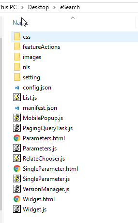
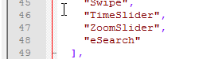
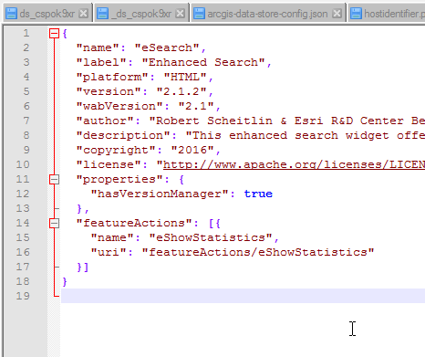
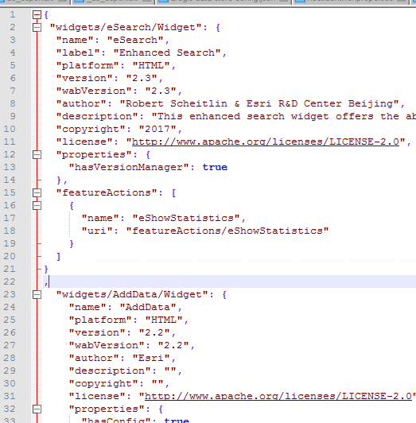

[Back to main menu](../index.md)  

Adding Custom Widgets to IMSMA Core
===================================

Purpose:
--------

The ArcGIS developer community has developed a variety of widgets that
can be used to add functionality to the Web AppBuilder version that
ships with ArcGIS Enterprise. These widgets are available through
GeoNet, on GitHub, and from various other sources. The Portal for ArcGIS
product is not intended to support custom widgets, but they can be added
through the following workflow. Note that this workflow is not supported
by Esri Support.

1.  Locate the Widget you want to add, it should be provided as a zip
    file with a single folder named after the widget. We will refer to
    this folder as the "widget folder"

    

2.  Copy the widget folder to C:\\Program
    Files\\ArcGIS\\Portal\\apps\\webappbuilder\\stemapp\\widgets

3.  Also copy the widget folder to C:\\Program
    Files\\ArcGIS\\Portal\\apps\\webappviewer\\widgets

4.  Edit C:\\Program
    Files\\ArcGIS\\Portal\\apps\\webappbuilder\\stemapp\\widgets\\list.json

    a.  Add "\<widgetName\>" to the bottom of the list, with a comma
        after the previous last item, like:

    b.  

    c.  The name should match the name of the folder you copied to
        \\widgets

5.  Locate the manifest.json file that should have been included with
    the custom widget, and copy the text it contains:

    

6.  Insert that JSON into the widget-manifest.json file in
    \\webappbuilder\\stemapp\\widgets

    a.  Paste the JSON inside the first curly bracket { and include a
        comma after the last pasted curly bracket }
        
