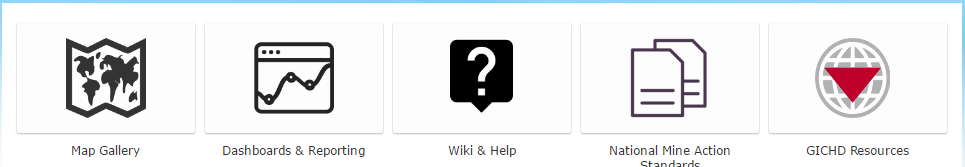

[Back to main menu](../index.md)  

IMSMA Core Portal Design
======================

Purpose
=======

This document aims to describe the different configurations, settings,
user accounts and content created inside of the Portal for ArcGIS
software that is a component of IMSMA Core. Many of these settings are
widely variable, but this document lays out what the basic
recommendations are for using IMSMA Core.

Assumptions
===========

-   Portal for ArcGIS 10.4.1+ will be installed as part of
    [most]{.underline} IMSMA Core deployments. In a low-resource
    deployment, ArcGIS Pro may be the only Esri product installed.

-   Users will authenticate with built-in Portal accounts, not using an
    existing directory or authentication provider

-   GICHD team members will either be involved in the deployment of the
    IMSMA Core components, participate remotely, or provide detailed
    guidance in the process.

Portal for ArcGIS Content and Structure
=======================================

User Roles
----------

Portal supports multiple roles for different logins. Roles govern what a
specific user can *do*, what functions they can execute, what
functionality they can access, and which settings they can change. In
general, there are three main user types in IMSMA:

-   Administrators

    -   One or more accounts that have full control over the system and
        can change all settings or configurations.

-   IMSMA Data Workers

    -   These users are entering data, manipulating existing data,
        approving submitted data, exporting data and creating
        information products. There are various different sub-types of
        roles here, but in general, this role is defined as anything
        between full administrative privileges and read-only privileges.

-   IMSMA Viewers

    -   This role represents users who may be workers in the field, at
        an NMAC or at a national government headquarters, whose only
        interaction with IMSMA is to view data, maps and content.

User Accounts
-------------

Users in IMSMA core will be provided with a login to the system. This
login username and password will be used to access content in the Portal
and will identify the user for the purpose of tracking edits,
controlling access to information and providing the user with tailored
content. User accounts can be pre-provisioned or created as part of
IMSMA setup. Under the Esri software licensing rules that IMSMA falls
within, each person needs a separate dedicated account, which also helps
with tracking usage and edits to data.

Homepage Content
----------------

The Portal homepage will also serve as the homepage for IMSMA Core's web
presence. This will be the primary web page for accessing web-based
content from within IMSMA, and also for interacting with content for
authenticated users. The homepage consists of two main sections:

-   The "Banner" section at the top, which may be an image or HTML

-   The scrolling carousel of "Featured Maps and Apps"

-   The "Description" section beneath it

**Banner**

The Banner section is composed of a single background image with text
overlaid on top of the image. This image may be provided as part of the
IMSMA-Core deployment, or may be customized by the deploying country.
The current banner is composed of HTML using the "Custom design" option
in Portal -\>My Organization-\>Edit Settings-\>Home Page-\>Banner:

`\<div\>
\
\

\
\IMSMA Core: Information Management
for Mine Action\</span\>
\</div\>
\</div\>`

**Featured Content**

The Featured Content or "Featured Maps and Apps" section is a carousel
or horizontal scrolling area which displays thumbnails and links to
items within the Portal. These thumbnails are generated based on the
items share to a single group, specified in the Portal-\>My
Organization-\>Edit Settings-\>Home Page-\>Featured Content section,
which can be designated by an administrator. This group may contain
items of any type, and the effect of clicking on an item thumbnail will
vary depending on the type of item. In general, the link will open a new
tab and take the user to the specified application.

In the IMSMA Core configuration, the **Featured Maps and Apps** group
will be used to display items in the carousel. The contents of this
group will vary for each NMAC or IMSMA deployment, but will generally
include:

-   Land Release Status

    -   This application will display an overall status for the entire
        country, based on the types and areas of Hazards and Released
        Land

-   3W Map -- Who What Where

    -   This map or application will display all ongoing Mine
        Action-related activities -- Technical and Non-Technical Survey,
        Clearance and Land Release, Mine Risk Education, Victim
        Assistance, Accident Reporting and locations of Organizations,
        field operations and staff.

-   *Additional apps to be provided on further discussion with GICHD*

The content of this carousel area is also controlled by a user's login
and group membership:

|Sharing | Visibility
|---|---
|Item Shared to Featured Content Group  |  Visible to members of the Featured Content Group
|Item Shared to Featured Content Group and other Groups | Visible to members of either group
|Item Shared to Featured Content Group and "IMSMA Portal" (My Organization) |   Visible to all logged-in users of IMSMA Core
|Item Shared to Featured Content Group and "Everyone" | Item visible to any user of the homepage (logged in or not)

Note: To change the contents of the homepage Featured Content group,
items may be shared or un-shared by an administrator or the item's
owner, either of whom need to be members of that group. The only way to
tailor the homepage to show different content per user is to manage
visibility with group membership. Ex. An NTS Status application could be
shared to Featured Content *and* the NTS Users group. That way, any NTS
user, member of either group or IMSMA administrator will see the content
on the homepage but others will not. This provides a method for
targeting content to users based on their role in the organization or
based on their login.

**Description**

This section can be configured as simple text or as HTML. In IMSMA Core,
this section will be used to display several key links, to other
locations within the IMSMA Core Portal or to external websites or
applications.

*Current Description Section (Draft):*

These items static (do not change based on user group membership) and
are configured in HTML, currently represented as:

`\
 \

\ \<a
href=\"https://imsma-core.esri.com/portal/home/group.html?id=66b4bacc761042c8a2763c1febe03595\"\>
\ \<span\>Map Gallery \</span\> \</a\> \</span\> \ \<a
href=\"https://imsma-core.esri.com/portal/home/group.html?id=59443249370c411a9dbb0445bfe4153f\"\>
\ \<span\>Dashboards &amp; Reporting\</span\> \</a\> \</span\> \ \<a href=\"http://mwiki.gichd.org\"\>
\ \<span\>Wiki &amp; Help\</span\> \</a\> \</span\> \ \<a
href=\"http://www.mineactionstandards.org/\"\> \ \<span\>National Mine Action Standards\</span\> \</a\> \</span\>
\ \<a
href=\"http://www.gichd.org/\"\> \ \<span\>GICHD Resources\</span\> \</a\> \</span\> \</div\> \</div\>
\<style type=\"text/css\"\> /\* Bottom Section\*/ \#bottomContent {
background: \#fff; margin-bottom: 50px; -webkit-border-radius: 0;
-moz-border-radius: 0; -o-border-radius: 0; border-radius: 0;
-webkit-box-shadow: none; -moz-box-shadow: none; -o-box-shadow: none;
box-shadow: none; \_border: 0 none; border-bottom: 0 none; }
\#bottomContent \#organizationSection { width: 960px; margin: 0 auto;
border: 0 none; } \#bottomContent \#organizationSection .grid\_1 {
display: block; float: none; } \#bottomContent .content { padding: 0; }
\#orgDetails { width: 100%; } .bottom-section-item { width: 20%;
display: block; float: left; padding-bottom: 30px; }
.bottom-section-item a { margin: 5px; background: \#fdfdfd; display:
block; padding: 5px; position: relative; -moz-border-radius: 2px;
-o-border-radius: 2px; border-radius: 2px; -webkit-box-shadow: 0 0px 1px
rgba(0, 0, 0, 0.12), 0 1px 1.5px rgba(0, 0, 0, 0.25); -moz-box-shadow: 0
0px 1px rgba(0, 0, 0, 0.12), 0 1px 1.5px rgba(0, 0, 0, 0.25);
-o-box-shadow: 0 0px 1px rgba(0, 0, 0, 0.12), 0 1px 1.5px rgba(0, 0, 0,
0.25); box-shadow: 0 0px 1px rgba(0, 0, 0, 0.12), 0 1px 1.5px rgba(0, 0,
0, 0.25); } .bottom-section-item a img { display: block; margin: 10px
auto; height: 80px; } .bottom-section-item a span { position: absolute;
margin-top: 15px; width: 100%; left: 0; text-align: center; color:
\#333; } .bottom-section-item a:hover { background: \#f5f5f5;
-webkit-box-shadow: 0 -1px 2px rgba(0, 0, 0, 0.12), 0 2px 2px rgba(0, 0,
0, 0.25); -moz-box-shadow: 0 -1px 2px rgba(0, 0, 0, 0.12), 0 2px 2px
rgba(0, 0, 0, 0.25); -o-box-shadow: 0 -1px 2px rgba(0, 0, 0, 0.12), 0
2px 2px rgba(0, 0, 0, 0.25); box-shadow: 0 -1px 2px rgba(0, 0, 0, 0.12),
0 2px 2px rgba(0, 0, 0, 0.25); -webkit-transition: all .2s ease-in-out;
-moz-transition: all .2s ease-in-out; -o-transition: all .2s
ease-in-out; transition: all .2s ease-in-out; } .bottom-section-item
a:active { background: \#f2f2f2; -webkit-box-shadow: inset 0 1px 1px
rgba(0, 0, 0, 0.12), inset 0 0px 7px rgba(0, 0, 0, 0.25);
-moz-box-shadow: inset 0 1px 1px rgba(0, 0, 0, 0.12), inset 0 0px 7px
rgba(0, 0, 0, 0.25); -o-box-shadow: inset 0 1px 1px rgba(0, 0, 0, 0.12),
inset 0 0px 7px rgba(0, 0, 0, 0.25); box-shadow: inset 0 1px 1px rgba(0,
0, 0, 0.12), inset 0 0px 7px rgba(0, 0, 0, 0.25); } \</style\>`

These buttons can link to outside applications or items within the
Portal. Note that any item linked here should either be publicly
available (does not require a login) or available to all logged in
users.

Groups and Group Membership
---------------------------

Groups within IMSMA core are used for two primary purposes -- **to
control access to content** (reducing the amount of content visible to
each user) and to **pull together relevant maps, apps and data for a
certain purpose**. Examples of the first use would be groups dedicated
to NTS entry, Clearance Reporting or Land Release Documentation, each
group containing apps and maps specifically for those functional roles.
Examples of the second use would be a group dedicated to a short-term
event or initiative, or a group dedicated to bringing together users
working in the same area of the country or region.

Groups are also used to collect specific apps and maps together for
workflow reasons. This might involve sharing three different apps to one
group, with the intent of having users use all three apps for different
purposes.

Security and Settings Configuration
-----------------------------------

-   Access via HTTP + HTTPS

-   Allow Anonymous Access = true

-   Built-in Users only
