[Back to main menu](../index.md)  

What is a task?
===============

A task is a set of preconfigured steps that guide you and others through
a workflow or business process. A task can be used to implement a
best-practice workflow, improve the efficiency of a workflow, or create
a series of interactive tutorial steps.

Components of a task item
-------------------------

A project can contain multiple task items and a task item can contain
multiple, related tasks. A task item has the following components:

1.  The task item, which contains one or many tasks.

2.  Task groups (optional), which are used to group related tasks.

3.  Tasks, which contain a set of sequential steps.

4.  Task steps, which perform actions.

A task is created in a task item and steps are created in a task. A
related set of tasks can be grouped into task groups.

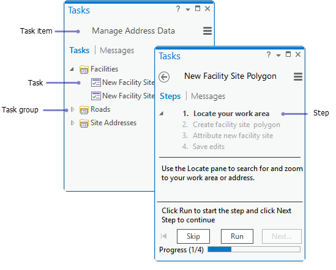

Task items open and display under the **Tasks** tab on
the **Tasks** pane. To open the **Tasks** pane, click the **View** tab
on the ArcGIS Pro ribbon and
click **Tasks** 

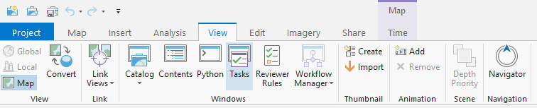

Task items are stored under **Tasks** on the **Catalog** pane. To open a
task item, right-click the task item under the **Tasks** folder on
the **Catalog** pane and click **Open**.

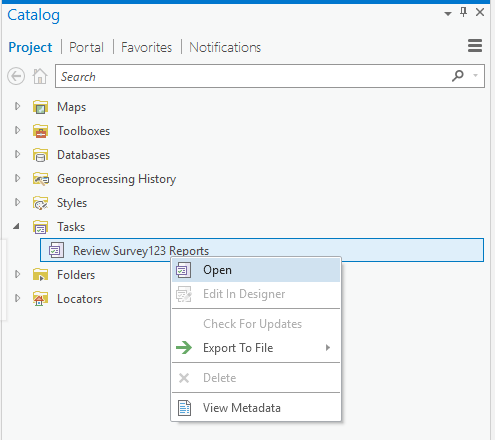

On the **Tasks** pane, tasks list under the task item name. Any error
messages or warnings for the task item are displayed under
the **Messages** tab.

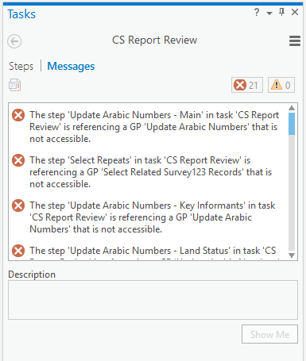

Tasks display as stand-alone tasks or in task groups. An individual task
is comprised of a set of sequential steps. A task step can be configured
to run a tool or command, set a map view, and set layer settings such as
selection and visibility.

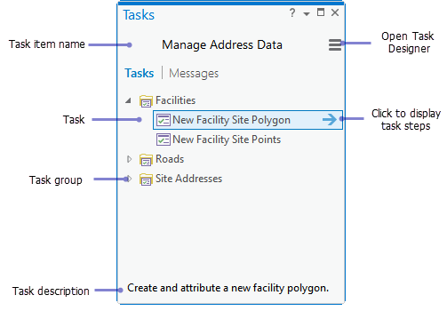

Share tasks
-----------

A task item can be exported to a task file, which can be imported into
and opened in another project. On the **Catalog** pane, right-click a
task item in the **Tasks** folder, point to **Export To File** and
click **Save As** to save the task item as a task file on your hard
drive.

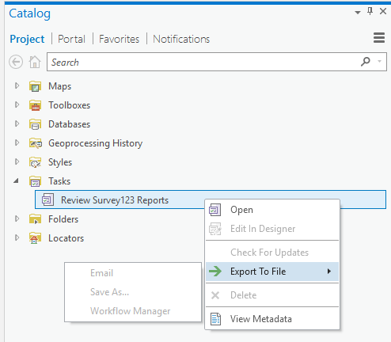

Design a task item
==================

A task item, task group, task, and task step is created and designed
using the **Task Designer** pane. The **Task Designer** pane displays
different parameters based on which component of the task is selected in
the **Tasks** pane, for example, the task item, task, or step.

Design considerations
---------------------

When designing a task item, factors to consider include who the audience
is, how the tasks will be used and what actions the steps will perform.
A well authored task reduces mouse clicks and improves efficiency. For
example, some steps can run commands automatically for your task user
such as zooming and panning the map display.

How will the task item be used?
-------------------------------

A task item contains a set of related tasks that can be used in the
following ways:

1.  Provide a best practice workflow for a business process.

2.  Enforce a correct workflow within an organization.

3.  Provide efficient, repeatable workflows.

4.  A tutorial that guides users through a series of interactive steps.

Consider whether you are designing a task item to contain tutorials or
repeatable workflows within your organization.

How are your tasks organized?
-----------------------------

How many task items and tasks will you need? What tasks will each task
item contain? Do related tasks need to be grouped in task groups in a
task item? For example, when designing tasks for managing address data,
tasks that deal with the creation of facilities are grouped.

What are the step behaviors?
----------------------------

Task steps can be run manually by the user or run automatically. Task
steps can also be hidden or optional.

-   Consider how your task moves from step to step. Does the step start
    automatically or does the user need to click **Run** to start the
    step? Does your task step require input from the user to move to the
    next step?

[Learn more about step
behavior](http://pro.arcgis.com/en/pro-app/help/tasks/create-a-step.htm)

Create a new task item
======================

Task items are stored with the currently open project and are listed
under **Tasks** on the **Catalog** pane. A task item
is [shared](http://pro.arcgis.com/en/pro-app/help/tasks/sharetasks.htm) by
exporting the task item to an .esriTasks file. An .esriTasks file can be
imported and opened in other projects.

To create a new task item, follow these steps:

1.  Click **Task \> New Task Item** 
     on the **Insert** tab on the ArcGIS
    Pro ribbon.

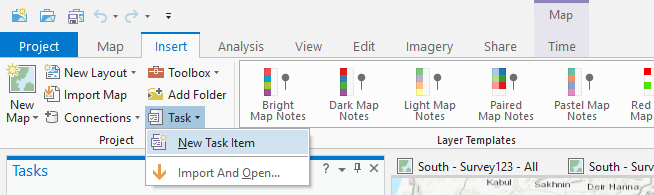

2.  On the **Task Designer** pane, type a name, author and description
    for your task item.

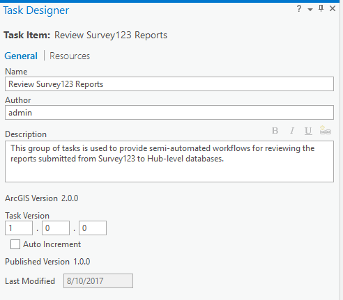

3.  Type a version number for your task item under **Task Version**.
    This must be manually updated each time the task item is updated.

> For information about how to track the task history click
> [here](http://pro.arcgis.com/en/pro-app/help/tasks/taskhistory.htm).

4.  Save the project to save the new task item.

Create a new task
=================

A task is created in a task item.

1.  Open and edit a task item. On the **Catalog** pane, right-click a
    task item in the **Tasks** and click **Edit In Designer**.

2.  Click **New Task** 
     on the **Tasks** pane to create a
    new task.

3.  A new, empty task is created and selected in the **Tasks** pane and
    the **Task Designer** pane displays the properties of the new task.
    The **Task Designer** pane is in task mode.

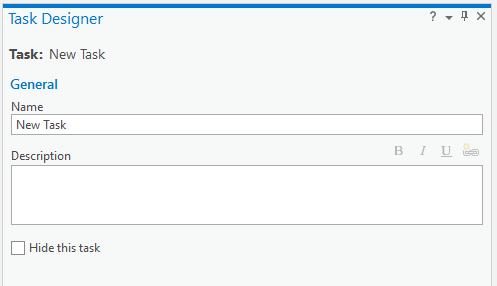

4.  On the **Task Designer** pane, type a task name and a description.
    The task description should describe what the task will achieve. For
    example, **Create a road centerline**.

5.  If you do not want the task to display in the tasks list on
    the **Tasks** pane, check the box next to **Hide this task**.

6.  Save the project to save the changes to your task item.

Create a new task group
=======================

A task can be created as a stand-alone task or in a task group. A task
group organizes a set of related tasks together. For example, a task
item that contains tasks for maintaining public roads may have a task
group for managing public roads, and a task group for plans and
drawings.

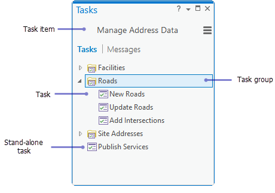

To create a new task group, follow these steps:

1.  On the **Catalog** pane, right-click a task item in
    the **Tasks** and click **Edit In Designer**.

2.  Click **New Group** 
     on the **Tasks** pane to create a
    new task group.

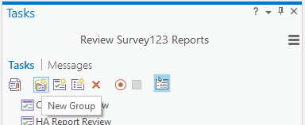

3.  A new, empty task group is created and selected in
    the **Tasks** pane and the **Task Designer** pane displays the
    properties of the new task group. The **Task Designer** pane is in
    task group mode.

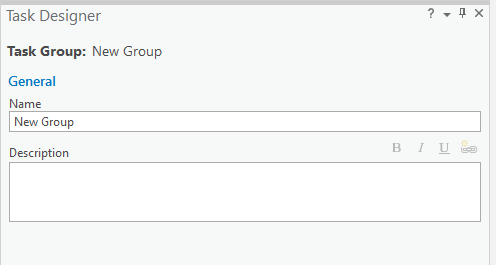

4.  On the **Task Designer** pane, type a task group name and
    description.

5.  Save the project to save the changes to your task item.

Create a task in a task group
-----------------------------

1.  Select the task group on the **Tasks** pane and then click **New
    Task** 
     A new task is created under the
    selected task group and the **Task Designer** pane switches to task
    mode.

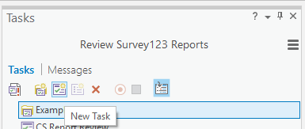

2.  Type a name and description for your new task on the **Task
    Designer** pane.

*Tip: When the **Task Designer** pane is open, you can drag and drop a
task into a task group, and between task groups.*

Create a task step
==================

Task steps are created within a task. Task steps should be sequential
and guide the task user through a workflow. A task step can load a
command that prompts the task user to perform an action such as entering
an attribute. A task step can be required or optional.

In the **Task Designer** there are four tabs for configuration of task
steps:

1.  Under the **General** tab, step properties such as the step name and
    behavior are set.

2.  Under
    the [Actions](http://pro.arcgis.com/en/pro-app/help/tasks/configstepcommand.htm) tab,
    an action is performed and a command or tool is set.

3.  Under
    the [Views](http://pro.arcgis.com/en/pro-app/help/tasks/configurestepview.htm) tab,
    the map views are set.

4.  Under
    the [Contents](http://pro.arcgis.com/en/pro-app/help/tasks/configurestepcontents.htm) tab,
    the map contents are set.

General
-------

To create a new task step, follow these steps:

1.  On the **Catalog** pane, right-click a task item in
    the **Tasks** and click **Edit In Designer**.

2.  Select the task you would like to add a task step to then click the
    **New Step** button.

3.  A new, empty task group is created and selected in the **Tasks**
    pane and the **Task Designer** pane displays the properties of the
    new task step. The **Task Designer** pane is in task step mode.

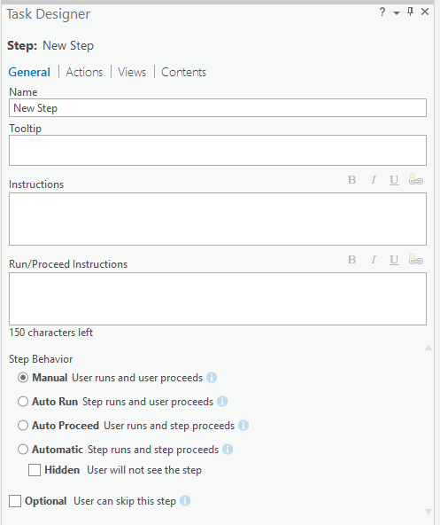

4.  Enter the name of the task step and any tooltips, instructions and
    run/proceed instructions.

5.  Choose the appropriate step behavior.

    -   Manual - The task user clicks Run to execute the step, completes
        an action, and clicks Next Step to proceed to the next step.

    -   Auto Run - The step automatically runs and Run is not available.
        The user completes an action and clicks Next Step to proceed to
        the next step.

    -   Auto Proceed - The user clicks Run to run the step. The step
        automatically completes an action and proceeds to the next step.
        Next Step is not available.

    -   Automatic - The step automatically executes, performs an action,
        and proceeds to the next step. Automatic steps can be hidden
        from the user if needed.

6.  Choose whether or not the step is optional, if checked this option
    will create a skip button for the task step.

Actions
-------

There are three types of actions which can be executed in a task step:

1.  Commands

2.  Geoprocessing Tools

3.  Get Attributes

To choose which command or toolset is executed in the step follow these
steps:

1.  Click the Actions header next to the General header.

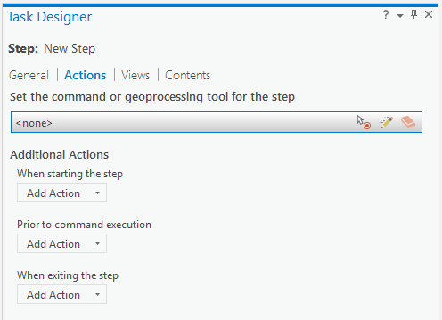

2.  To configure a step to run a command or geoprocessing tool, click
    the **Record** 
     or **Edit** 
     icon on the command action bar.

3.  Click
    the **Record** icon 
     and click a command on the ArcGIS
    Pro ribbon to quickly load or change a command.

4.  Click
    the **Edit** icon 
     to browse to or search for a command
    or geoprocessing tool.

5.  Click the drop-down list under Type of Command and choose Command,
    Geoprocessing Tool or Get Attributes.

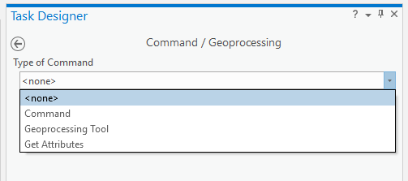

### Command

For Command, locate the command you want to use. Choose List of Tabs to
find the command by its tabbed location on the ribbon, or choose All
Commands to search for the command by typing the command name.

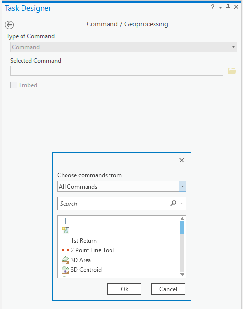

Some commands can be embedded in the **Tasks** pane when the step runs.
When the step runs, an embedded command opens and displays in
the **Tasks** pane instead of in a separate window pane.

Some embeddable commands support preset parameters. Preset parameters
become available in the **Task Designer** pane
under **Command/Geoprocessing** when the command is embedded.

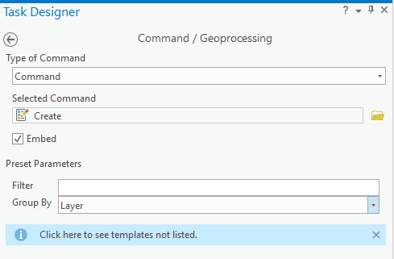

For example, when embedding the **Create** 
 command, the preset
parameters **Filter** and **Group By** are available. These parameters
can be preset to control how the feature list is displayed in the
embedded **Create Features** window when the step runs

[Learn more about embedding
commands.](http://pro.arcgis.com/en/pro-app/help/tasks/appendix-embeddedcommands.htm)

### Geoprocessing Tool

For Geoprocessing Tool, locate the tool you want to use. You can search
for a geoprocessing tool by typing the tool name.

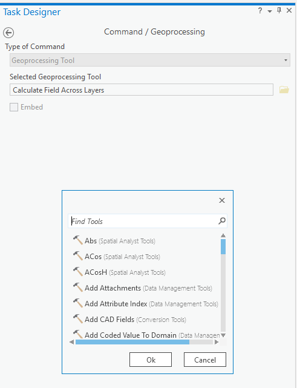

When a geoprocessing tool is loaded as the step tool, it is embedded by
default. When the step runs, an embedded geoprocessing tool opens and
displays in the **Tasks** pane instead of in a
separate, **Geoprocessing** pane. When a geoprocessing tool is loaded
and embedded, the tool parameters display in the **Task Designer** pane
under **Command/Geoprocessing**.

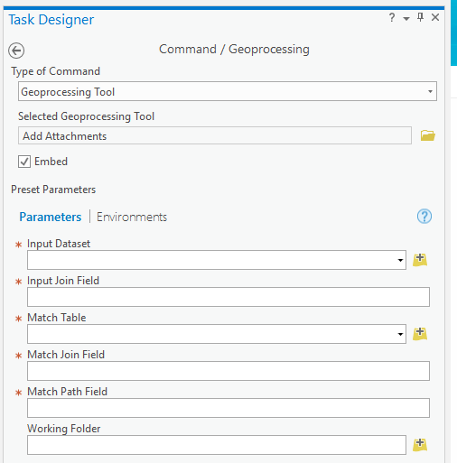

Geoprocessing tool parameters can be left empty, which requires the task
user to populate them when the step runs, or the task author can
populate them with preset values. If the tool parameters are populated
with preset values, the step can automatically run the tool without
requiring input from the task user.

### Get Attributes

For Get Attributes, click Add Attribute to define an attribute to get
from the task user.

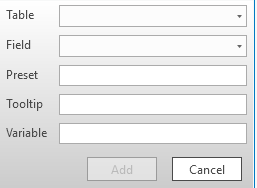
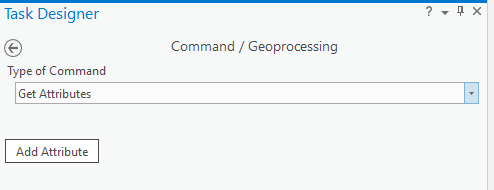

-   On the pop-up dialog box, define the attribute properties as
    follows:

-   Choose the table that contains the attribute field for which the
    user will provide a value.

-   Choose the attribute field for the user-provided value.

-   If necessary, enter a preset value. A preset value can provide a
    prefix for the entered attribute value; for example, all attributes
    in the field start with 101.

-   Enter a ToolTip. The ToolTip is displayed when the user hovers over
    the attribute field text box. A ToolTip can be used to provide more
    information about what attribute value the user should enter.

-   Enter a variable name. The variable is used to store the attribute
    value provided by the user and is available for the Calculate Field
    step action.

### Additional Actions

Additional Actions can be carried out when starting the step, prior to
command execution or when exiting the step. The options for additional
actions are:

-   Selection

-   Copy Attributes

-   Calculate Field

-   Verification

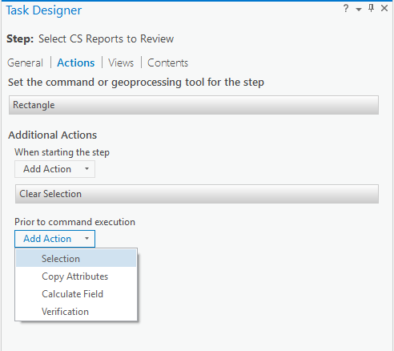

#### Selection

A task step can manage feature selections in the following ways:

-   Save currently selected features to a selection that can be used by
    subsequent steps

-   Save newly created features to a selection that can be used by
    subsequent steps

-   Save modified features to a selection that can be used by subsequent
    steps

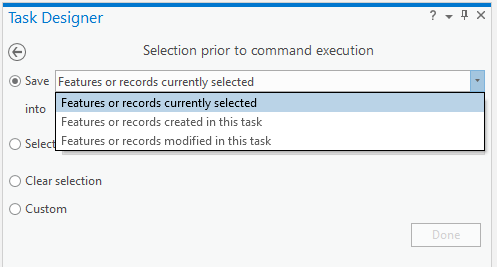

-   Select newly created features

-   Select modified features

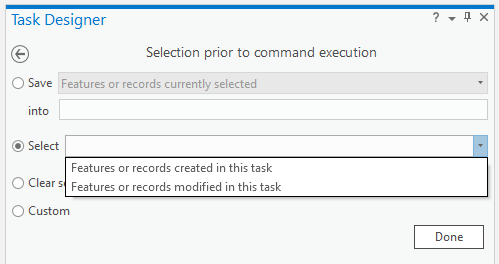

-   Clear selections

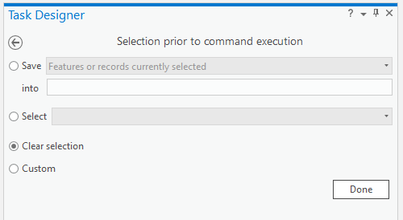

-   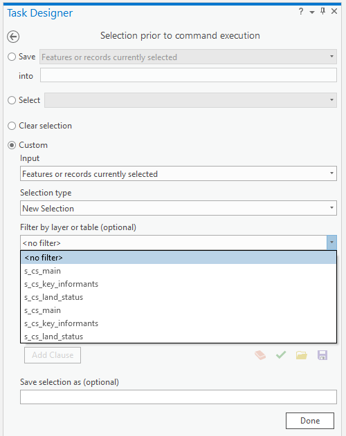
    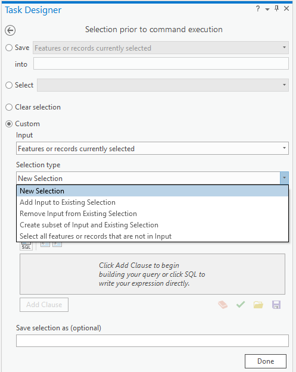
    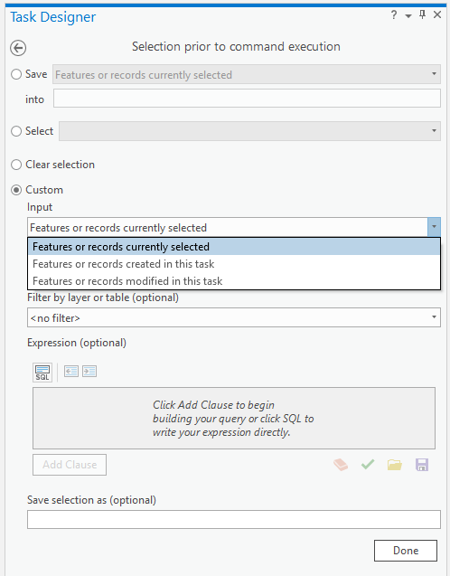
    Filter selections using a SQL
    expression

For more information about step selections click on the links below:

-   [Manage selections when starting a
    step](http://pro.arcgis.com/en/pro-app/help/tasks/configureselections.htm#GUID-480CFBC4-FA61-459D-84BA-15E75E2F1C46)

-   [Manage selections before the step command
    executes](http://pro.arcgis.com/en/pro-app/help/tasks/configureselections.htm#GUID-F2D6BB58-9F2D-406C-B887-08FAC0662E6B)

-   [Manage selections when exiting the
    step](http://pro.arcgis.com/en/pro-app/help/tasks/configureselections.htm#GUID-2065BFC1-CC9B-4AB6-81CE-19F515447610)

-   [Custom
    selections](http://pro.arcgis.com/en/pro-app/help/tasks/configureselections.htm#ESRI_SECTION1_3E6A7B41BF574499B27A9E91DC2AE275)

#### Copy Attributes

A task step can be configured to copy one or more attributes from a
single, selected feature or record. The copied attributes are saved into
a variable that can be used by subsequent steps. A step can use the
saved attributes to calculate other attribute fields. For example, copy
and store an attribute and use it to calculate the fields of new
features created in the task.

Attributes can be copied from a currently selected feature or record, a
newly created feature in the task, or a feature that has been modified
in the task. Attributes can also be copied from a feature in a [saved
selection](http://pro.arcgis.com/en/pro-app/help/tasks/configureselections.htm).

To configure a step to copy attributes, click **Options** in
the **Tasks** pane and click **Edit In Designer**.

1.  In the **Tasks** pane, expand the task and choose the step you want
    to configure.

2.  Click the **Actions** tab in the **Task Designer** pane.

3.  Click the **Add Action** drop-down menu under **When starting the
    step**,** Prior to command execution** or **When exiting the
    step** and choose **Copy Attributes**.

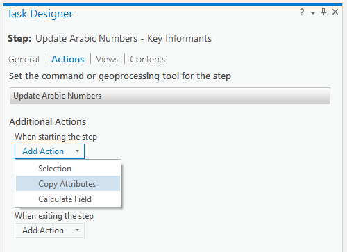

4.  Choose the feature or record from which to copy the attributes
    under **Copy attributes from**.

5.  Choose the attribute table under **From Table**.

6.  Click **Add Attribute** to choose the attribute field to copy.

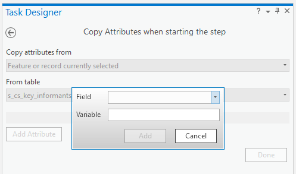

7.  Enter a name for the variable that will store the copied attribute.

8.  Click **Add Attribute** to copy another attribute or
    click **Done** to return to the **Actions** tab.

For more information about the use cases for copying attributes when
starting the step, prior to command execution, or when exiting the step
click
[here](http://pro.arcgis.com/en/pro-app/help/tasks/configattributes.htm#GUID-59DC1EFC-1EC9-47BB-9C6D-449D5AC49509).

#### Calculate Field

A task step can use the [Field
Calculator](http://pro.arcgis.com/en/pro-app/help/data/tables/fundamentals-of-field-calculations.htm) to
calculate the attributes of features or records in the active [step
view](http://pro.arcgis.com/en/pro-app/help/tasks/configurestepview.htm).

A step can calculate the attribute fields of currently selected features
or records, features or records in a [saved
selection](http://pro.arcgis.com/en/pro-app/help/tasks/configureselections.htm),
newly created features or records, and features modified in the task. A
step can use the field calculator to perform the following field
calculations:

-   Calculate field values to the values of another, available attribute
    field.

-   Calculate field values to a value you specify.

-   Calculate field values to the value saved in a task variable.

-   Perform advanced calculations using Python code blocks.

To configure a step to calculate attribute fields, click **Options** in
the **Tasks** pane and click **Edit In Designer**.

1.  In the **Tasks** pane, expand the task and choose the step you want
    to configure.

2.  Click the **Actions** tab in the **Task Designer** pane.

3.  Click the **Add Action** drop-down menu under **When starting the
    step**,** Prior to command execution**, or **When exiting the
    step** and choose **Calculate Field**.

4.  Choose the features or records for which to calculate attribute
    fields under the **Input Selection** drop-down menu.

5.  Choose the attribute table under **Input Table**.

6.  Choose the attribute field that will be calculated under **Field
    Name**.

7.  Use the [Field
    Calculator](http://pro.arcgis.com/en/pro-app/help/data/tables/fundamentals-of-field-calculations.htm) to
    define how the attribute field is calculated.

8.  Click **Done** to return to the **Actions** tab.

For more information about the use cases for calculating attributes when
starting the step, prior to command execution, or when exiting the step
click
[here](http://pro.arcgis.com/en/pro-app/help/tasks/configattributes.htm#ESRI_SECTION1_4070397D8F254A6FBFFB40EBF9E31818).

#### Verification

You can use step verification to confirm that the task user has edited,
created, or selected the correct number of features in a step. Step
verification can furthermore check that attribute values meet specified
conditions. Verifying step actions performed by task users can prevent a
task from failing to run.

To configure a step to verify features and attribution,
click **Options** in the **Tasks** pane and click **Edit In Designer**:

1.  In the **Tasks** pane, expand the task and choose the step you want
    to configure.

2.  Click the **Actions** tab in the **Task Designer** pane.

3.  Click the **Add Action** drop-down menu under **Prior to command
    execution** or **When exiting the step** and
    choose **Verification**.

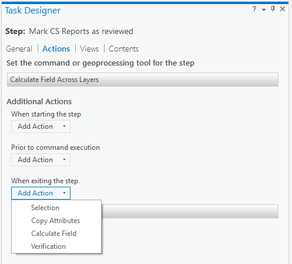

4.  Choose the features to verify from the **Verify number of
    features** drop-down list. Features can also be verified from
    a [saved
    selection](http://pro.arcgis.com/en/pro-app/help/tasks/configureselections.htm).

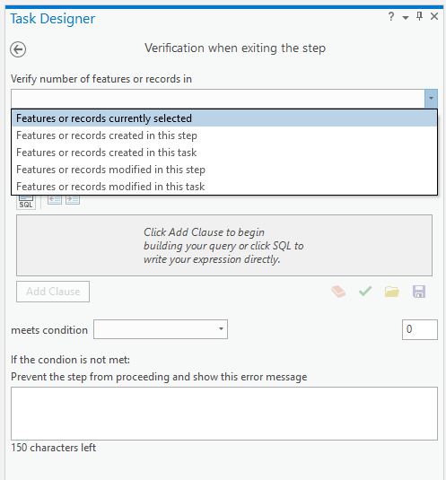

5.  Choose the attribute table of the features to be verified from
    the **in table** drop-down list.

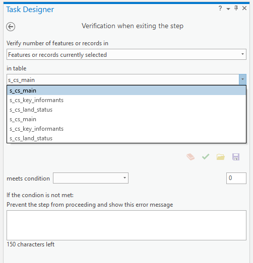

1.  Choose whether to apply a filter check on the attributes of the
    features by clicking **Filter selection using expression**.

> You can use a filter expression to verify that the attributes of the
> features being verified meet a specified condition. For example,
> verify that the Key Informants field in the selected Community Survey
> features is not null.

2.  Choose the verification condition from the **meets
    condition** drop-down list.

> You are verifying the number of features from the **meets
> condition** drop-down list. For example, **Verify number of features
> in** \<features edited in this step\>** in
> table** \<s\_cs\_main\> **meets condition**\<Equal to\> 1.

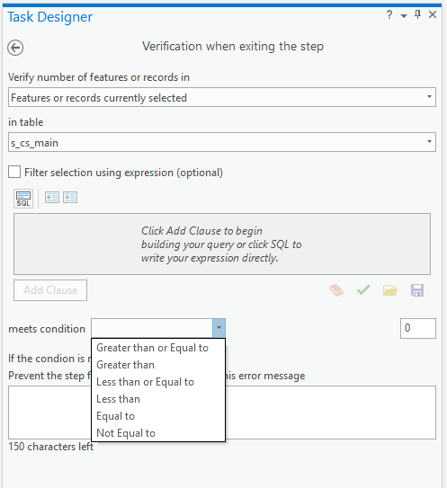

3.  Type an error message to display when the verification conditions
    are not met under **Prevent the step from proceeding and show this
    error message**.

Views
-----

A view is the window that displays geographic data in ArcGIS Pro. A view
displays maps, scenes, and layouts.

Only views that are part of the current project are accessible to the
step. A step can open and activate a view, close a previously opened
view, or leave the state of the view unchanged from the previous step.

To configure views for a step, click **Options** in the **Tasks** pane
and click **Edit In Designer**:

1.  In the **Tasks** pane, expand the task and choose the step you want
    to configure.

2.  Click the **Views** tab in the **Task Designer** pane.

3.  Choose the view that will be active for the step. The active view is
    always toggled as
    open 
    

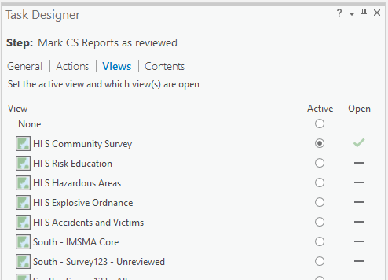

4.  If applicable, choose the view that will be closed when the step
    runs. Under **Open**, click to toggle the icon to **Closes the
    view** 
    

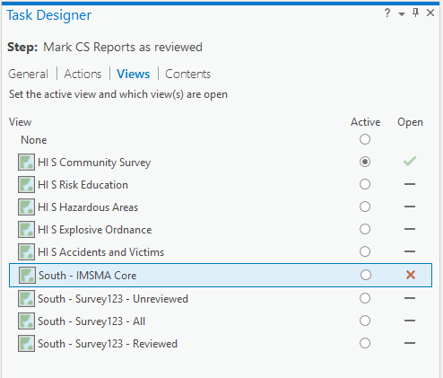

5.  If applicable, leave the states of any remaining views as unchanged.
    Under **Open**, click to toggle the icon to **Performs no
    action** 
    

> Instead of toggling the state of each project view, click **Current
> View** to match the current view states of the open project.
> Similarly, click **Previous Step** to match the view settings of the
> previous step.

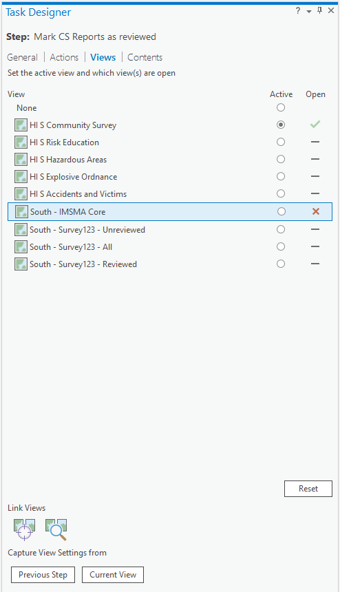

> Click **Reset** to set **None** as the active view and toggle the
> states of all available views to **Performs no action** 
> 

6.  To link the open views to the active view, toggle the **Center
    Views** 
     or the **Center and Scale
    Views** 
    button on or off.

Contents
--------

Contents are a list of elements in the currently active view, for
example, map layers and tables. Contents display in
the **Contents** pane in ArcGIS Pro.

A task step can set the visibility, selectability, editing state,
labeling, and snapping of layers in the active map view. For stand-alone
tables, a step can set the editing state of the table. A step can also
select a layer or table in the **Contents** pane.

A view must be active on the **Views** tab for its contents to be
available on the **Contents** tab. To configure the contents for a step,
click **Options** in the **Tasks** pane and click **Edit In Designer**:

1.  In the **Tasks** pane, expand the task and choose the step you want
    to configure.

2.  Click the **Views** tab in the **Task Designer** pane.

> For each layer or table, click under the icons for **Visible** 
> , **Selectable** 
> , **Editable** 
> , and **Snappable** 
> to change the states of the layer. You
> can also press the V key to change visibility, the S key to change
> selectability, the E key to change editability, and the N key to
> change snapping.

-   Click to turn the visibility, selectability, editing state, and
    snapping of the layer or table
    on 
    

-   Click to turn the visibility, selectability, editing state, and
    snapping
    off 
    

-   Click to keep the visibility, selectability, editing state, and
    snapping unchanged 
     The layer or table state remains
    the same as it was for the previous step or before the task started.

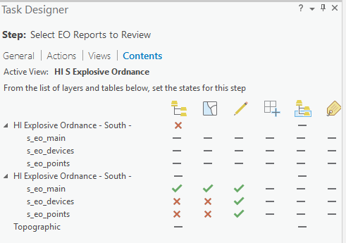

3.  Click under the **Select Layer or Table** 
     icon to change whether or not a
    layer is selected in the **Contents** pane. You can also press
    the H key to change layer selection.

4.  Click under the **Labels** icon 
     to turn the labels of a layer or
    table on or off. You can also press the L key to change labeling.

5.  Turn **Snapping** 
     **On** or **Off** for the active
    view, and click a snap mode to enable it.

> Enabled snap modes appear shaded.

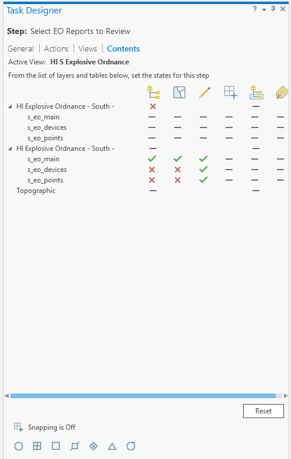

> [Learn more about enabling
> snapping](http://pro.arcgis.com/en/pro-app/help/editing/enable-snapping.htm)

6.  Instead of switching layer and table states, click **Current
    View** to match the current layer and table states of the active
    view. Similarly, click **Previous Step** to match the states and
    snap modes of the previous step.

> Click **Reset** to set all layer and table states to **Performs no
> action** 
>  and to turn off snapping.

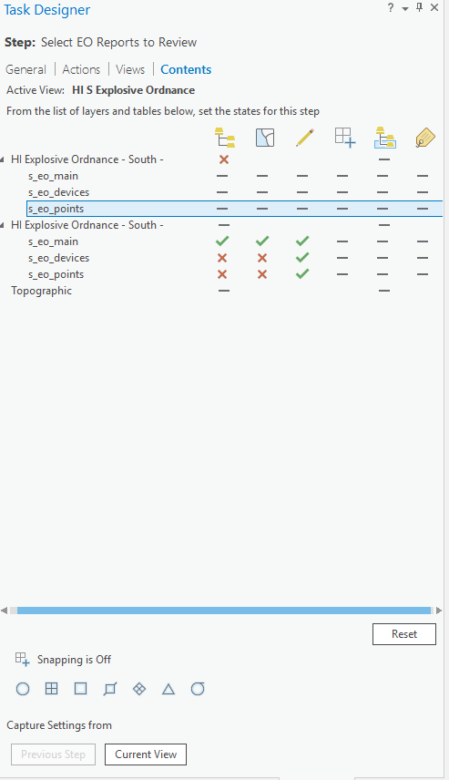 

For examples of configuring step contents click
[here](http://pro.arcgis.com/en/pro-app/help/tasks/configurestepcontents.htm#ESRI_SECTION1_A95420FADE3B41BCB251C49DC273CB41).

Task item validation
====================

Task items are validated to ensure that they have been authored
correctly. When a task item is opened, it is automatically validated,
and errors are listed under the **Messages** tab in the **Tasks** pane.
Task validation errors occur when task steps reference project items
that are inaccessible, for example, a task step that references a layer
that has been removed from the active view.

When authoring a task item, the task item is automatically validated for
both errors and best practices. When the **Task Designer** pane is open,
any errors and warnings are displayed under the **Messages** tab.
Warnings are suggestions for best practice design, for example, warnings
about missing task steps and tasks with duplicate names.

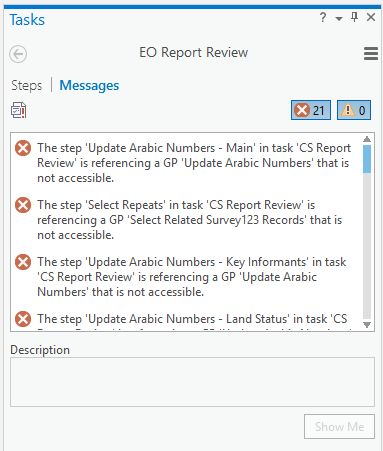

To resolve a task error, first make sure the inaccessible item is part
of the project. Select the error listed under the **Messages** tab and
click **Show Me**.

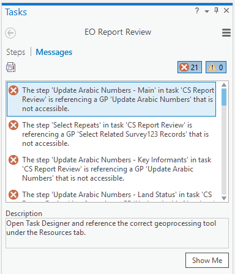

Under the **Resources** tab in the **Task Designer** pane, set the
broken task resource to reference the correct project item.

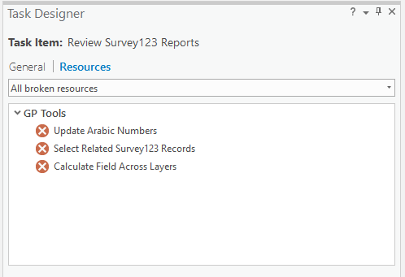

After resolving existing task errors,
click **Validate** 
 under **Messages** in the **Tasks** pane
to confirm that there are no more errors or to check for any additional
errors.

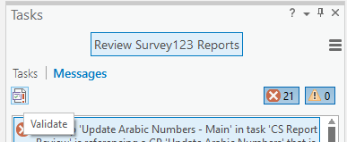

[Learn more about task
errors](http://pro.arcgis.com/en/pro-app/help/tasks/taskerrors.htm)
