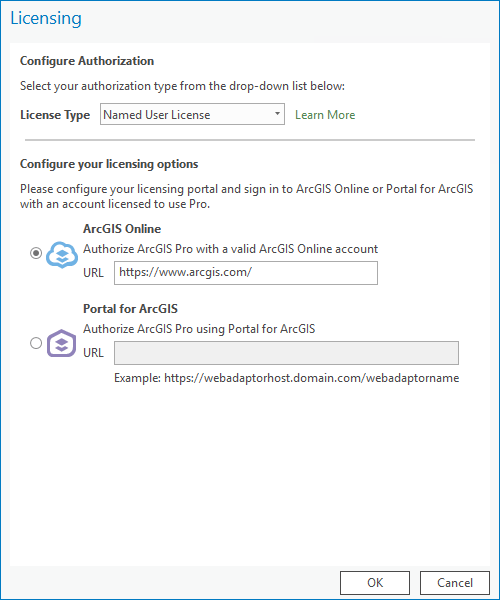
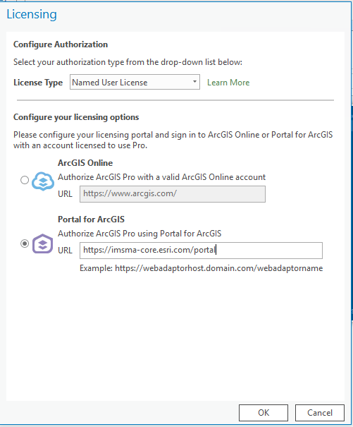
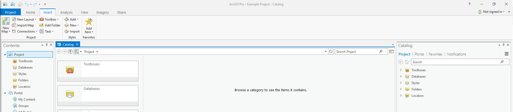
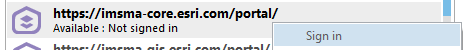
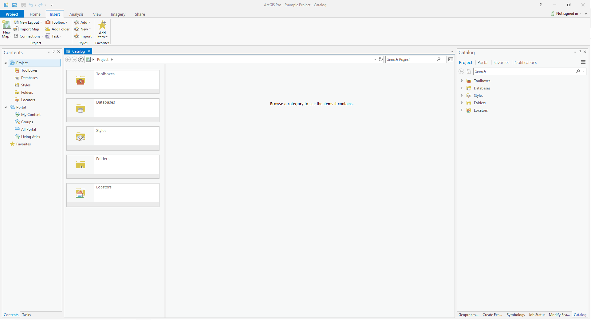
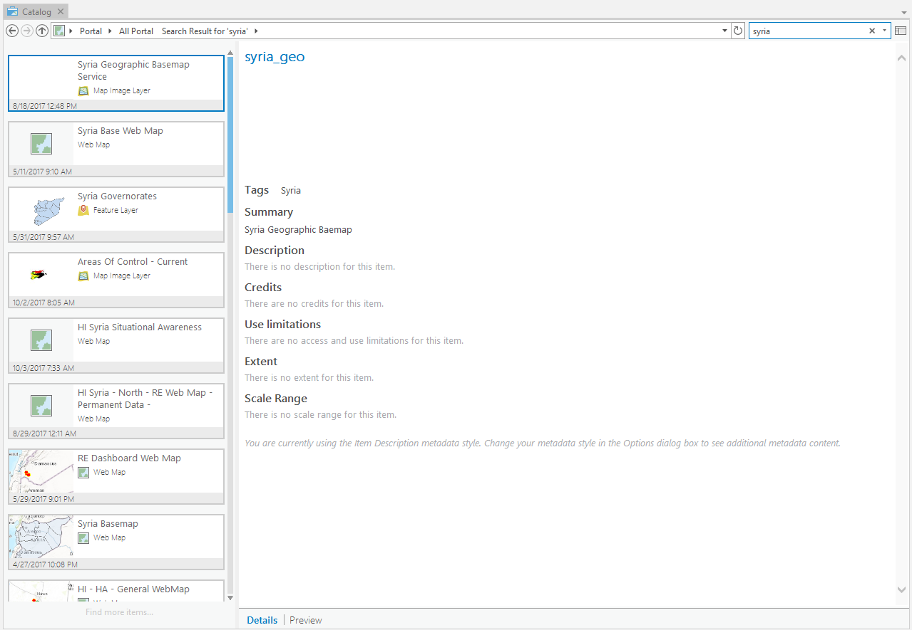

[Back to main menu](../index.md)  

Accessing IMSMA Core
====================

If You Have Not Signed In Before
--------------------------------

1.  Open ArcGIS Pro, if it is your first time opening it you will be
    prompted to sing in to ArcGIS.

2.  Click **Configure your licensing options**

3.  Select the dot next to **Portal for ArcGIS**

4.  Enter the URL for the IMSMA organization then click OK

If You Have Signed In Before
----------------------------

1.  Open ArcGIS Pro and open an existing project or create a new
    project.

2.  Click the **Project** tab on the ribbon and click
    the **Portals** page. You can also access the **Portals** page from
    the **Manage Portals** link in the **Sign In** menu 
    

 

3.  Click **Add Portal**.

4.  Enter the URL for the portal on the **Add Portal** dialog box and
    click **OK**.

5.  Optionally, sign in to the portal. Right-click the URL and
    click **Sign in**. Enter your user name and password.

6.  To make the new connection your active portal, right-click the URL
    and click **Set As Active Portal**.

Accessing Content in IMSMA Core
===============================

There are two Catalog experiences with ArcGIS Pro: the Catalog Pane and
the Catalog View. For more information about the two Catalog experiences
click
[here](http://pro.arcgis.com/en/pro-app/help/projects/the-project-pane.htm).

Catalog Pane
------------

The **Catalog** **Pane** allows you to access all items associated with
a specific project in one place, whether they are available from a local
or network computer, ArcGIS Online, or your organization\'s portal.

 

The **Project** tab provides access to the collection of items in your
project; it is selected by default. The **Portal** tab provides access
to collections of online content available from the active portal that
you have permission to use. The **Favorites** tab allows you to collect
frequently used folder, database, and server connections, and add them
to your project. The **Notifications** tab lists any messages received
while working on your project; messages are cleared from the tab when
you switch projects or restart ArcGIS Pro.

Catalog View
------------

The **Catalog View** provides a rich gallery experience for exploring
items. This can be helpful if you aren\'t sure which item to use,
especially if you are accessing the active portal for the first time or
if you use ArcGIS Pro infrequently.

 

The **Contents Pane** controls the options available in the Catalog
View. The same item collections are available in the catalog view as in
the Catalog Pane: **Project**, **Portal**, and **Favorites**. When the
catalog view is active, quick links to the different item categories and
collections are available in the **Contents** pane.

When you choose **All Portal** you not see any items in the Contents
View until you enter a search term. When you click on a given item you
will see the item details on the right. At the bottom of the Details
view you can switch to a Preview of the item.

