[Back to main menu](../index.md)  

**ArcGIS Solution Deployment Tool**
=================================================

1.  [Download](http://links.esri.com/download/ArcGISSolutionDeployment/) the
    ArcGIS Solutions Deployment Add-In.

2.  Close ArcGIS Pro before installing the add-in.

3.  Using Windows Explorer, browse to the folder to which you downloaded
    the add-in.

4.  Double-click SolutionDeployment.esriAddInX to run the installer.

5.  Click the **Install Add-In** button.

**Adding Fields and Domains to Feature Layers**
=============================================================

1.  Find the desired web map by going to **Project**, then under
    **Portal** click **My Content**. Right click on the map name and
    choose **Add and Open**.

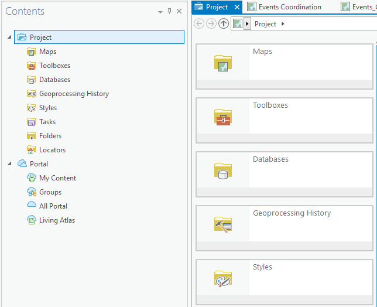

2.  On the **Share** tab, in the **Deploy** group, click the **ArcGIS
    Solutions** button.

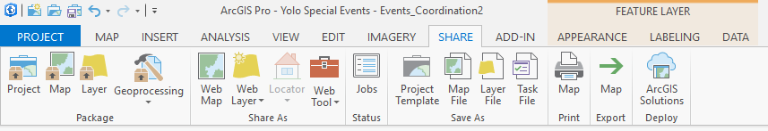

3.  Double-click Configure an ArcGIS Solution in the **Tasks** pane.

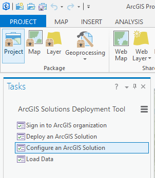

4.  Add missing fields to the feature layer by populating the Add Fields
    geoprocessing tool, and clicking **Run**.

    i.  If you know the name of the domain you would like to apply to
        the field type in the name. If you would like to create a new
        domain wait until step 5.

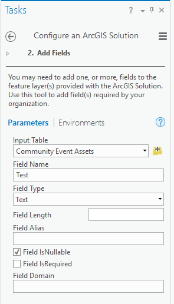

5.  Repeat this step for each field you would like to add.

6.  Click **Skip** to get to the next tool. Choose the layer and field
    you would like to create or modify a domain for.

    ii. If Type is None, change it to Coded Value and enter the
        appropriate codes and descriptions.

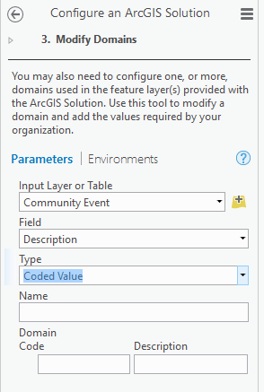

iii. Click **Run**.

<!-- -->

7.  Repeat this step for each domain you would like to add/modify.

8.  Once you have finished modifying domains, click **Finish**.

9.  Sign in to your ArcGIS organization, browse to the map you're
    working on, and click **Open**.

10. Hover over the layer name and click on the three dots below the
    layer name then click **Configure Pop-Up**.

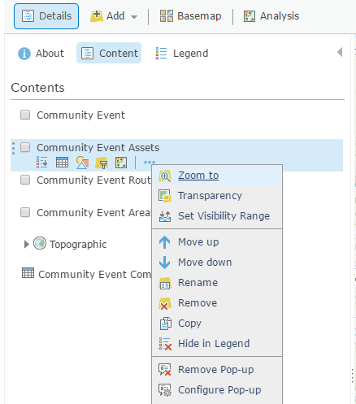

11. Make sure the checkbox in the display column is checked next to the
    field(s) that has been added.

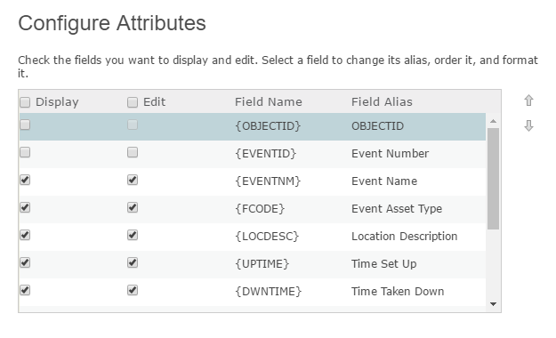

12. Click OK then click OK and save any changes to the web map.

**Modifying the Symbol Set**
==========================================

1.  Find the desired web map by going to **Project**, then under
    **Portal** click **My Content**. Right click on the map name and
    choose **Add and Open**.

2.  On the **Share** tab, in the **Deploy** group, click the **ArcGIS
    Solutions** button.

3.  Double-click Configure an ArcGIS Solution in the **Tasks** pane.

4.  Click **Next Step** then click **Skip**.

5.  Choose the layer and field you would like to modify a domain for.

    i.  Add or delete Codes as necessary.

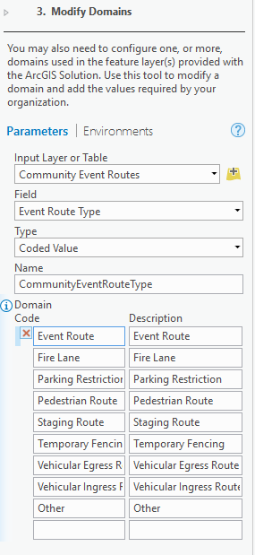

ii. Click **Run**.

<!-- -->

6.  Sign in to your ArcGIS organization, browse to the map, and click
    **Open**.

7.  Hover over the layer name and click on the three shapes.

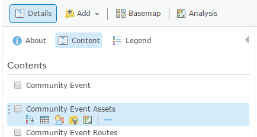

8.  Under Select a drawing style, Types (Unique symbols) click on
    **OPTIONS**.

9.  The domain codes added in step 5 will be under Other. Click
    **Ungroup** to add them to the symbol options.

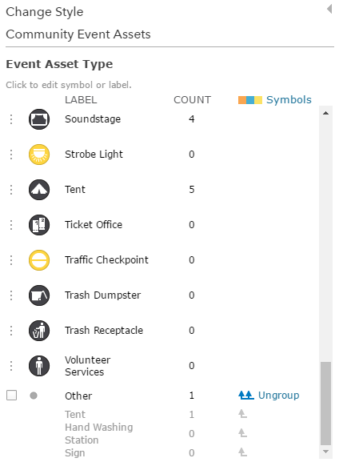

iii. To modify the symbology of the newly ungrouped asset types click on
    the symbol next to the label.

<!-- -->

10. Click **OK**, then click **DONE**.

11. Hover over the layer name and click on the three dots below the
    layer name then click **Save Layer**.

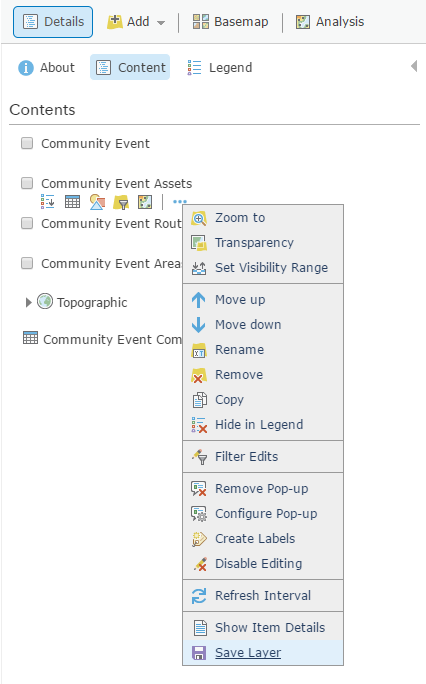

12. Save the web map.

**Modifying the Symbology in ArcGIS Pro**
=======================================================

1.  Find the desired web map by going to **Project**, then under
    **Portal** click **My Content**. Right click on the map name and
    choose **Add and Open**.

2.  In the **Contents** pane click on the symbol you'd like to modify.
    This will open the **Symbology** pane.

    i.  Make changes as needed and click **Apply**.

3.  On the **Share** tab, in the **Share As** group, click the **Web
    Map** button.

4.  Set the map name and details as desired then click **Share**.

5.  Sign in to your ArcGIS organization, browse to the new map, and
    click **Open**.

6.  Hover over the layer name and click on the three dots below the
    layer name then click **Save Layer**.

7.  Browse to the map, and click **Open**.

8.  Hover over the layer name and click on the three dots below the
    layer name then click **Remove**.

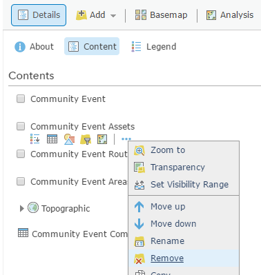

9.  Click **Add**, then click **Search for Layers**.

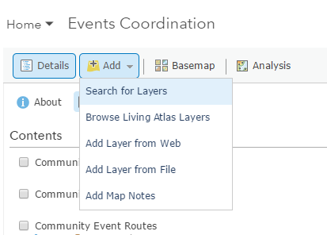

ii. Find the layer you want and click **Add**.

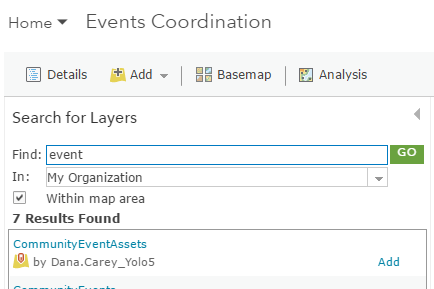

iii. Remove any duplicate layers.

<!-- -->

10. Save all changes to your web map.

11. Delete the new/duplicate web map published from ArcGIS Pro.
