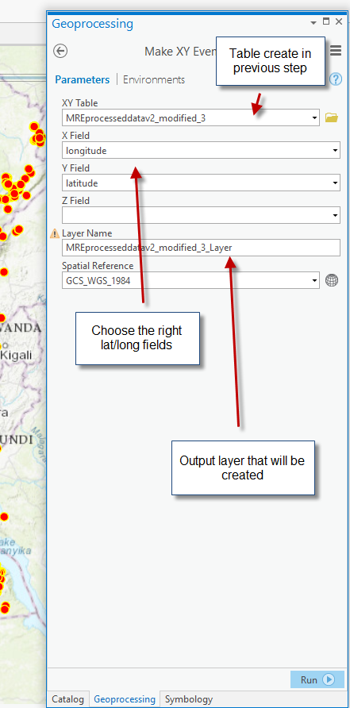
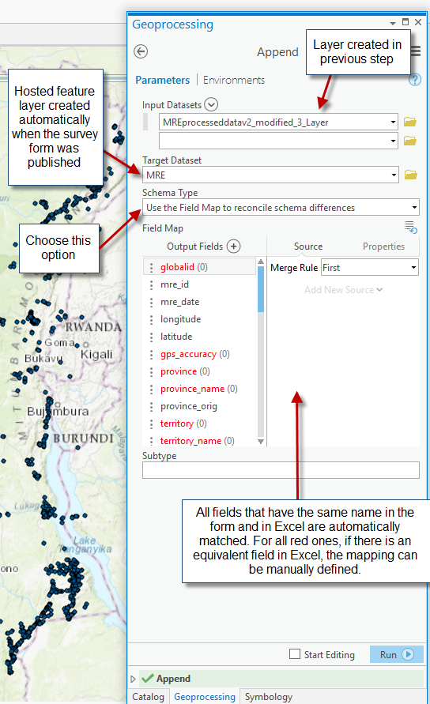

[Back to main menu](../index.md)  

# Import Excel data into a hosted feature layer

This document describes the following use case: there is data available
in Excel format, and the country would like to have this data imported
into IMSMA Core, along with a Survey123 form that will then allow
entering more of this data.

Concrete example: UNMAS DRC had several thousand of MRE records in an
Excel file and requested to have:

-   A Survey123 form allowing to enter MRE data in the future

-   All records from the Excel file imported into IMSMA Core

The following steps are required to achieve this:

1.  Prepare the Survey123 form according to the requirements. Since this
    survey defines the structure of the resulting hosted feature layer
    it is important that it matches the structure of the data in the
    Excel file (or that the Excel file is modified so that it matches
    the Survey123 structure).

2.  Publish the Survey123 form to the Portal.

3.  Prepare the Excel data so that it matches the Survey123 structure.
    This is quite an important step and probably the one requiring most
    attention and work. For example, it needs to be ensured that:

    a.  For single choice fields, the values in the Excel sheet exactly
        match the value options (name, not label!) defined in the
        Survey123 form.

    b.  All data types are compatible.

    c.  All fields defined as required in the form actually have a value
        in the Excel.

    d.  Geographic coordinates are defined for all records (in the same
        Spatial Reference).

    e.  Etc.

4.  Open ArcGIS Pro. It is recommended to do this operation directly
    from the server for performace reason.

5.  Run the following three Geoprocessing tools, in this order (search
    for the names in the Toolbox):

    a.  ExcelToTable: this tool allows creating a GDB table with the
        data from the Excel..

    

    b.  MakeXYEventLayer: this tool allows creating an event layer from
        the table created in the previous step. This basically creates
        the geo structure from the coordinates.

    

    c.  Append: this tool allows writing the data from the previously
    created event layer into the final target layer.

  

Issues that may be encountered:

-   Incompatible data types

-   String fields too short (e.g., a long text comment may not fit into
    a 255 char field -- in this case the field can be defined as
    accepting more characters in the form design).

-   Possible issues with date formats (check that the column in the
    Excel file is defined as date)

-   There is no value in the Excel for a field defined as required in
    the form design.

-   Etc.

Tips and Tricks:

-   When an append fails, some records may have been already copied, it
    is important to delete the records before trying to append again
    otherwise there may be some duplicate records in your final table.

-   One way to prevent the issue described above is to perform Append
    runs on a test feature class. The test feature class can be created
    in a File Geodatabase using the CreateFeatureClass tool and using
    the destination feature class from the portal as template.
