[Back to main menu](../index.md)  

Importing Archival Information into IMSMA Core
==============================================

**Purpose**: Many Mine Action Programs have historic data about their
operations that may be stored on another IT system, in spreadsheets, in
Access Databases, etc. This data should all be able to be migrated into
IMSMA Core to merge with data collected via Survey123, but given the
diversity of formats and filetypes that could be included in archival
datasets, the can be a complicated and somewhat one-off process. This
document aims to provide guidance as to how to migrate this archival
data reliably.

**Outline:**

1.  Identifying existing data

2.  Consider the details of exporting information from existing systems

3.  Identify options for geospatially-enabling existing data

    a.  Joining to community point or boundary feature

    b.  Generate based on x/y in existing data

4.  Adding data to ArcGIS Pro

5.  Using Display X/Y Data

6.  Using Append + Field Mappings

7.  Testing Append against a temporary FC

8.  Appending to the final Feature class

9.  Using SQL to update created\_date and created\_user (Sam to add)

**Definitions**

-   Domain

-   Append

-   Schema

-   Join

Identifying the Data
====================

If your program has been collecting the same type of data as the new
IMSMA Core module that is being implemented it may need to be migrated
to the new system. Not all data needs to be migrated, the following
questions can help you figure out if the data should be migrated:

-   Will the prior data inform current operations?

-   Do you need to do year over year analysis of data?

If the data needs to be migrated you will need to obtain the following
information:

-   Where is the data currently and what format is it in?

-   What formats can the data be exported to?

Exporting the data to a spatial format is ideal if possible, if not
there are ways to spatially enable the data. Spatially enabling data
means tying information stored as text, such as a province name, a
community name or a referenced location to a spatial location, with an X
and Y value in Latitude and Longitude coordinates.

Reviewing the Data
==================

Prior to exporting the data and loading it into the new system it is
important to review the data for quality and clean the data as needed.

**Check Domain Values **

Many databases support coded value domains which store a value in the
database that is different from the description which the user sees. In
the export you will need to check whether the value or the description
was exported and adjust to whichever more closely matches the domain
value of the new IMSMA Core data schema. Coded vale domains are often
used as pick lists to enforce data entry to follow a few options for a
field. IMSMA Core has similar concepts that can be applied to data
collection and it is important to make sure that the archival values
match the allowed values in IMSMA Core for a domain-controlled field.

If there was a free text entry field in the archive data that will be
appended to a field with a domain the values must match the domain
values. Computers are sensitive to case, misspellings and spaces so if
you have an *Yes* values going into a field with a domain value of *yes*
they must be adjusted.

**Clear NA or None Values**

Consider any fields that have NA or None. In some cases this is
appropriate, whereas in other cases the field should be blank. Also,
make sure to review any key fields that are blank. Some examples of key
fields include location, activity identifier, name of reporting
staffperson and date.

**Rename Fields and Columns**

In order to ease the migration of this dataset, it is recommended to
rename columns in the archival data to match the destination dataset,
even using the destination dataset as a sample structure and copying the
archival data in using Excel's tools and functions like VLOOKUP.

Geospatially Enabling Existing Data
===================================

There are two main options for geospatially enabling existing data:

-   Join the record to a community point or boundary feature and make
    use of the existing geometry

-   Generate the point for the archival record based on existing x/y
    location data, usually as Latitude and Longitude

Join to Community Point or Boundary Feature
-------------------------------------------

The most accurate location information that is not X/Y data is based on
[Common Operational
Datasets](https://www.humanitarianresponse.info/en/applications/tools/category/operational-datasets).
A critical part of Administrative Boundary Common Operational Datasets
are P-Codes which have the following components:

-   Country Code - This is taken from the ISO 2-letter country code
    standard. For most purposes, this code does not need to be included
    when giving the p-code for a place.  However, one good reason for
    including it is that it will force any p-code to be recognized as
    text rather than a number, which has the advantage of being sure
    that leading zeroes are not dropped.

-   Admin 1 to Admin x - Each admin level gets a numeric code with
    enough leading zeros to ensure that the occasional addition of new
    admin units will not exceed the number of digits available.  In the
    example below, two digits are adequate for admin levels 1 - 3
    (meaning that there will not be more than 99 admin units in any one
    of these levels).  Level 4 can have as many as 999 admin units.

-   Incremental Settlement Numbers - For simplicity of maintenance, it
    is best to use a single set of incremental numbers across the whole
    country (rather than within each admin unit).  This has the
    additional advantage of allowing places to be referred to using only
    the settlement number without the admin unit codes, making them
    shorter. Enough digits should be used here to allow for the
    possibility of new datasets to be added. An example community PCode
    would be the community of **Konibodom** being known as **C0024.**

The new data from the surveys will likely be using this format based on
the Common Operational Dataset from the country of interest. If the
archival data has numeric codes for the admin levels or P-codes then it
can be joined more easily to a spatial dataset. A review should be done
to ensure that the archival data has the same numeric codes as the new
dataset schema.

If the data only has location names then it is recommended that numeric
codes are added or multiple admin levels are combined into one new data
field. This is necessary to create unique values that a join to the
spatial dataset can be based on.

To **join** your data to existing records, you should ensure that every
row has a PCode for the settlement, rather than using an inexact
attribute like community name -- which can be spelled many ways -- as
your join attribute. Also make sure the spatial layer has an X/Y
attribute for Latitude and Longitude that has been calculated based on
the geometry.

Once the you join the communities layer to the archival data layer, you
can export this table to a temporary location, then re-add it to your
Project. Then continue to the section below for guidance on making this
data into an X/Y Event Layer

Generate Points from X/Y locations
----------------------------------

If your data already has X/Y data included as numeric or text values,
you should review the fields to check for any blank records. You can
also look at the minimum and maximum values to see if the values are in
the expected range for the area of interest. Selecting a few records and
confirming they map to the expected location is another way to help
verify the accuracy of the data.

Once you have reviewed the X/Y data, turning it into a geographic
location will occur in ArcGIS Pro.

Adding Data to ArcGIS Pro
=========================

Once the data has been cleaned it must be added to ArcGIS Pro to
geospatially enable it.

1.  Open ArcGIS Pro and open a new or existing project.

2.  In the Catalog pane right click on **Folders** then select **Add
    Folder Connection**. Navigate to the folder in which your archival
    data has been stored.

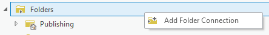

3.  If your data was stored as a CSV you will be able to right click and
    select **Add to New Map**. If your data was stored as an **XLS** you
    will need to double-click on the XLS file in the Catalog and then
    select the sheet in the spreadsheet with the data then right click
    and select **Add to New Map.**

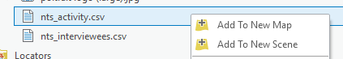

4.  If your archival data has X/Y data follow the following steps. If
    your data has other location data skip to step 5.

    a.  Right click on the dataset and select **Display XY Data**.

    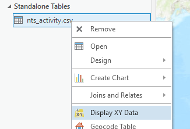

    b.  Fill out the parameters, making sure the appropriate fields are
    specified for the X and Y values then click **Run**.

    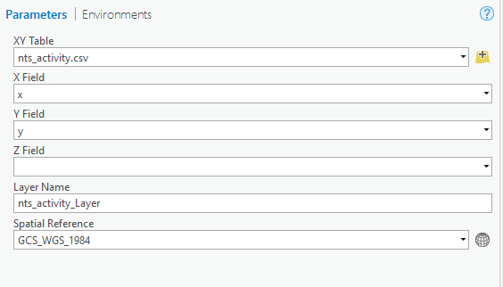

    For most archival data, the Spatial Reference will be GCS\_WGS\_1984.

    c.  Right click the new layer, select **Data**, then select **Export
    Features**.

    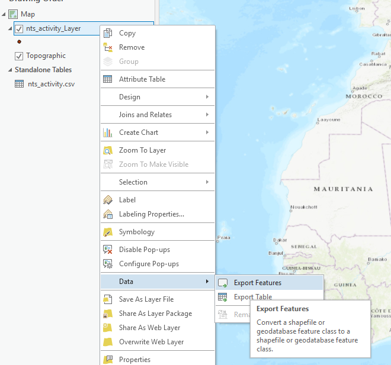

    d.  Choose the name and location of the new feature class then click
    **Run**.

    e.  Close the current map and add the new feature class to a new map.

<!-- -->

5.  **To Join Data,** in the Catalog pane navigate to the feature class
    or shapefile of the administrative layer or settlement layer that
    you would like to join the archival data to. Right click it and
    select **Add to Current Map**.

    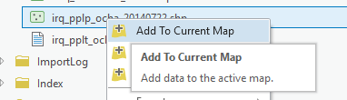

    > *\*\*\*Make sure the spatial data you are joining to your archival
    > data has X/Y coordinates as attributes. If it does not use the Add
    > Geometry Attributes Geoprocessing Tool to add fields with the point
    > coordinates or centroid coordinates.*

    a.  Right click on the archival data table and select **Joins and
    Relates** then select **Add Join**.

    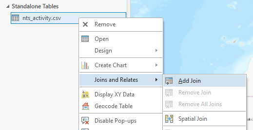

    b.  Set the Join Table as the administrative layer. Set the Join Fields
    as the P-Code or other unique identifier field. Click **Run**.

    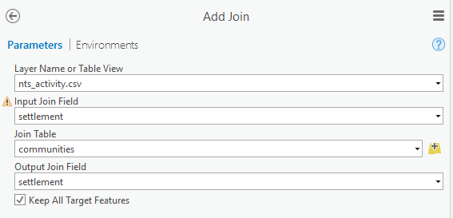

    > *If you get a warning about the join field not being indexed you can
    > safely ignore it unless you have a very large number of records.*

    c.  Right click on the dataset and select **Display XY Data**.

    

    d.  Fill out the parameters, making sure the appropriate fields are
    specified for the X and Y values then click **Run**.

    

    e.  Right click the new layer, select **Data**, then select **Export
    Features**.

    

    f.  Choose the name and location of the new feature class then click
    **Run**.

    g.  Close the current map and add the new feature class to a new map.

    h.  Right click on the layer, select **Design** then select **Fields**.

    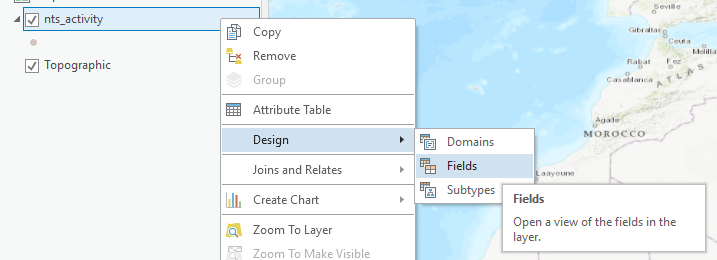 

    i.  Review the fields in the layer and delete any unnecessary fields
    from the admin layer that was joined to the archival table. Right
    click the selected fields and select **Delete**.

    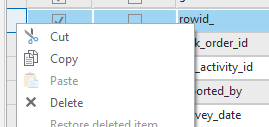

    j.  Click **Save**.

    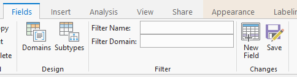

Appending the Data to IMSMA Core
================================

Once the data has been added to ArcGIS Pro and geospatially enabled it
must be appended to the new dataset. Prior to appending it to the real
dataset it is best to test the append function against a copy of the
dataset.

1.  In the Catalog pane navigate to the target dataset (the layer in
    IMSMA Core that you will append to), right click on it, select
    **Copy**.

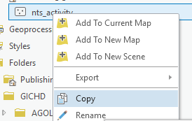

2.  Right click on the project geodatabase at the top of the ArcGIS Pro
    Catalog pane and select **Paste**.

3.  Right click on the copied feature class and select **Add to Current
    Map**.

4.  Go to the **Analysis** tab and select **Tools**.

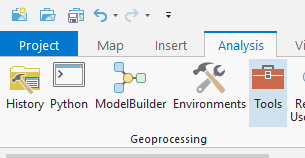

5.  Type **append** in the Find Tools bar and select the **Append** data
    management tool.

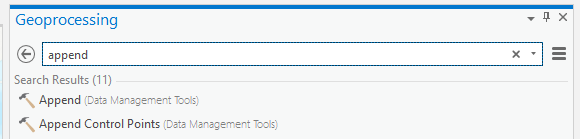

6.  Set the archival feature layer as the Input Dataset and the copy
    feature layer as the Target Dataset. Select **Use the Field Map to
    reconcile schema differences** as the Schema Type.

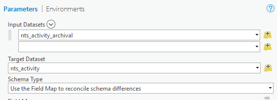

7.  Any fields that don't have a match will show as red. Click on the
    field then click on **Add New Source**.

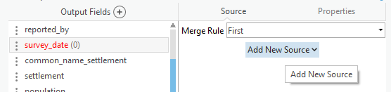

8.  Select the field in the archival feature layer that should populate
    the field in the copied feature layer. If no matching or appropriate
    source field is available, it will be blank in all of the appended
    data. Any field names that match precisely will automatically map to
    the destination fields.

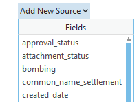

9.  Ensure that no features are selected by opening the Edit toolbar in
    the ribbon and clicking on the Clear Selection button. When you have
    mapped all the fields click **Run**. This will append all rows from
    the archival dataset to the target

10. Right click on the copied feature layer in the Contents pane and
    click **Attribute Table**.

11. Review the data that was appended to the copied feature layer to
    make sure the data appended properly and all the values are
    appearing as they should.

12. If the append was successful, official destination layer to the map
    and repeat the steps above to append the archival data to the
    destination layer in IMSMA Core. Note that direct database
    connections are recommended in this case if possible, appending to a
    feature service layer directly may be slow for large datasets.
