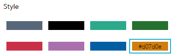
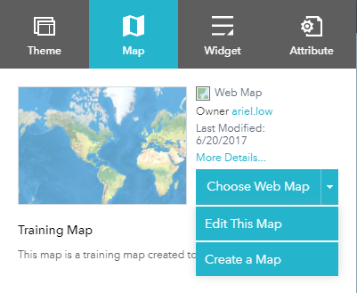
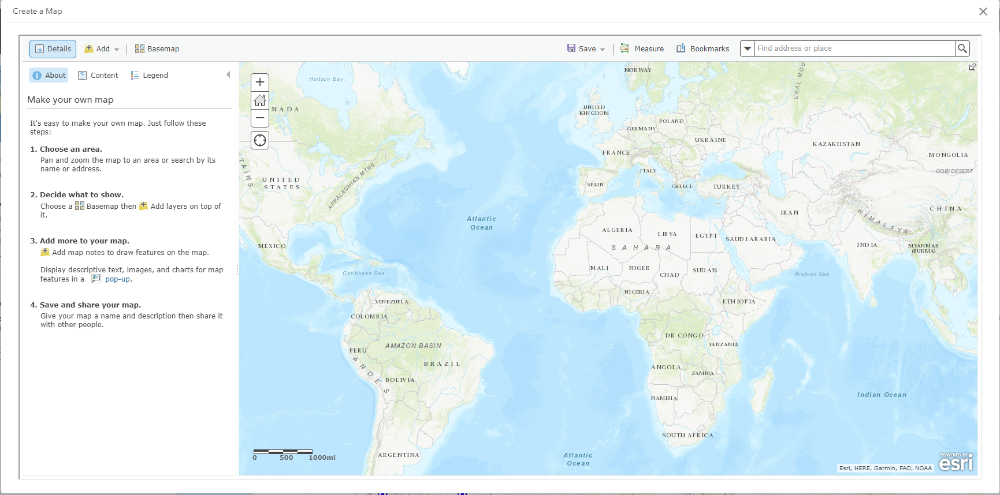
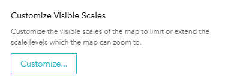
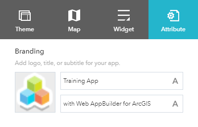
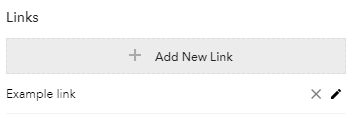

[Back to main menu](../index.md)  

Web AppBuilder Overview
=======================

Web AppBuilder allows you to create apps by accessing workflow tabs
including [Theme ](http://doc.arcgis.com/en/web-appbuilder/create-apps/themes-tab.htm), [Map](http://doc.arcgis.com/en/web-appbuilder/create-apps/map-tab.htm), [Widget](http://doc.arcgis.com/en/web-appbuilder/create-apps/widgets-tab.htm),
and [Attribute](http://doc.arcgis.com/en/web-appbuilder/create-apps/attributes-tab.htm).

Theme
-----

A theme is a template framework representing the look and feel of an
app. Content in a theme includes a collection of panels, styles, and
layouts, and a set of preconfigured theme widgets. A single app can only
use one theme while running.

Web AppBuilder for ArcGIS provides out-of-the-box themes.
The **Theme** tab supports the following:

-   Billboard---Designed for the app with simple tasks. It has the most
    layouts of all the themes and does not display the logo, links, and
    widget controller. All the widgets in the theme are on-screen
    widgets.

-   Box---Focuses on the widgets in the widget controller. By default,
    all on-screen widgets are turned off. There are no placeholders for
    widgets and no logo or links display. It is designed for the app
    that requires a clean look on the map.

-   Dart---Widgets in the widget controller display as placeholder
    widgets. You can have multiple widgets open and move them around. By
    default, all on-screen widgets are turned off. Similar to the Box
    theme, there are no placeholders for widgets and no logo or links
    display.

-   Dashboard---All the widgets in the panel open simultaneously when
    the app starts. It is designed to visualize widgets and their
    communication directly. You can modify the predefined layout by
    adding or removing grids, or resizing the grids in the panel. By
    default, most on-screen widgets are turned off except the Home, Zoom
    Slider, and Full Screen widgets. Optionally, you can turn on the
    Header widget to display the logo, the app name, and links.

-   Foldable---The first theme created by Web AppBuilder, it supports
    all widget types and can be used for the app with complicated tasks.

-   Jewelry Box---Evolved from the Foldable theme with a focused widget
    on the left of the app. It is designed for the app with a workflow
    task.

-   Launchpad---Designed for users who prefer the Apple Mac style. It
    allows you to open multiple widgets, and move, resize, and minimize
    them.

-   Plateau---Can be used to create a modern and basic application with
    flat toolbars and widget containers.

-   Tab---As with the Foldable theme, it supports all widget types and
    can be used for the app with complicated tasks.

Formatting Themes
-----------------

Once you have chosen a theme you will have some options to format it:

-   Select a style---The available styles vary depending on the theme
    selected. Most themes have seven predefined colors from which to
    choose, except the Launchpad and Dashboard themes. If your
    organization has defined the [shared
    theme](http://doc.arcgis.com/en/arcgis-online/administer/configure-general.htm) with
    a header color, it will be the default color when a new app is
    created. You can also choose your own color by clicking the last
    color in the color
    picker.    
    

-   Select a layout---A layout represents a preset placement of user
    interface
    items.    
    

    -   Only the Dashboard theme allows you to modify and generate your
        own layout.

    -   When you build 2D apps, the available layouts vary depending on
        the theme selected. In addition, there are two styles of layout.
        One is for desktop and one is for mobile devices. When either
        the height or width of a screen display is less than 600 pixels,
        the mobile layout applies.

    -   When you build 3D apps, each theme has two layouts for desktop
        only.

Map
===

The app created by Web AppBuilder for ArcGIS is based on a web map or
web scene from ArcGIS Online or Portal for ArcGIS. 2D apps are built
with web maps and 3D apps are built with web scenes. A web map or web
scene usually includes a basemap and operational layers that you want
the users to interact with. When the **Map** tab is active, the
thumbnail, the summary, and the owner of the web map or web scene
display.

Use the **Map** tab to select a web map.

When you use the **Map** tab to select a web map for your app, the
following functions are supported:

    

-   **Choose a web map**---Click **Choose web map** to open the window
    and choose the web map from the portal. The **Choose web
    map** windows are categorized by how they are shared.

    -   The **My Content** filter is selected by default in the portal.
        In addition to the specified portal, ArcGIS Online is an option
        for the Public web maps. Click the **My Content**, **My
        Organization**, **My Group**, or **Public** tabs to filter the
        web maps in that category. In addition, it provides sorting on
        the maps based on the categories of most recent, most viewed,
        highest rated, title, and owner.

    

-   **Edit the web map**---Click the arrow on **Choose web map** to open
    the drop-down menu and click the **Edit this map** button to open
    the selected web map in Map Viewer. Edit the map as you normally do
    in Map Viewer and save it if you are the owner of the map or save it
    as a copy if you are not. When you close Map Viewer, the selected
    web map in your app is automatically updated.

    

-   **Create a new web map**---Click the **Create a map** button on
    the **Choose web map** drop-down menu. Map Viewer opens a new map.
    Author the map as you normally do in Map Viewer and save it. When
    you close Map Viewer, your new map automatically becomes the
    selected web map in your app.

    

You can also:

-   View the details of the selected web map---Click **More
    details** right next to the map thumbnail to open the item details
    page for the map.

    

-   Set the initial map extent for the app---Zoom in or out to the
    appropriate map extent and click **Use current map view**, or
    click **Use web map\'s default extent**.

    

-   Customize map visible scales---Click **Customize** to open
    the **Customize Visible Scales** window, which lists all the
    existing scales from the map. You can delete the existing scales or
    add new scales to limit or extend the scale levels, which the map
    can zoom to.

    

Widget
======

The **Widget** tab allows you to configure the functionality of the app.
As widgets are specifically designed to work with 2D or 3D data content,
a set of widgets for 2D apps is different from 3D apps. In addition, the
initial set of widgets may vary from theme to theme, as each theme has
its own preconfigured set of widgets. Following are the widgets from the
Foldable theme when you build 2D apps.

To configure a widget, hover over the widget thumbnail and click the
edit
icon 
 to open the widget configuration window.

[]{#_gjdgxs .anchor}

Off-panel and in-panel widgets
------------------------------

The preconfigured widgets may include both [off-panel and in-panel
widgets](http://doc.arcgis.com/en/web-appbuilder/create-apps/widget-overview.htm).
The off-panel widgets for a theme display when the **Widget** tab is
activated. They can be turned on or off by the eye
icon 
. The off-panel widgets that are not part
of the theme can be added to the widget controller.

The in-panel widgets can be removed or added from the widgets
collection. There are two ways to add widgets from the widgets
collection: by setting the controller widget or the placeholders.

Click **Set the widgets in this controller** to open the page for
in-panel widgets.

Click **+** to open the widget collection that allows you to select and
add widgets to the application.

In the **Choose Widget** window, search for the widget or select one or
more widgets. The selected widgets are highlighted in the blue boxes.

To reorder the widgets in the controller, click a widget and drag it to
the location you prefer, wherever the red line appears.

You can also group in-panel widgets by dragging one or more widgets into
another widget. The grouped widget shows as a folder icon on the
controller widget. To ungroup the widget, drag each widget out of the
group.

On-screen widgets
-----------------

On-screen widgets are those that display their icons within the map
area. Usually, they include the preconfigured off-panel widgets from the
theme and widgets in the placeholders.

The placeholder is labeled by a number. Click it to open the widget
collection window. Only one widget can be selected for a placeholder.
Widgets added in the placeholders can be dragged onto the map. They also
can be resized by dragging the lower right corner of the panel.

When the widget configuration completes, click **Save**.

The widget added from the widgets collection can be set to open
automatically when apps start. To do so, click the dot on the widget to
change it to dark green. A maximum of two widgets can open
automatically: one is on the controller and another in the placeholder.

Attribute
=========

The **Attribute** tab allows you to perform basic customization at the
app level, such as configuring your app\'s banner, state, and extra data
sources.

Branding
--------

You can add a logo, a title, a subtitle, and links to the banner.

1.  The app logo defaults to the logo defined by your organization when
    available. Otherwise, click the logo icon and choose **Custom** to
    open the file browser and select an image file. If you don\'t want
    to have a logo in the app, hover over the logo and click the X icon
    on the logo to remove it.

    

2.  Click the **A** button to customize the font style for the title of
    the app.

3.  Click the **A** button to customize the font style for the subtitle
    of the app.

4.  Click **Add New Link** to add a hyperlink to the banner, and provide
    a name and valid URL.

    

5.  To edit a link, hover over the link name and click the pencil icon.
    To remove a link, click the X icon. A maximum of four links can be
    added.

    

App state
---------

Check the **App state** check box to keep the map extent and layer
visibility when you exit the app. It is turned on by default. This
option is not available when you build 3D apps.

[Back to main menu](../index.md)  
