[Back to main menu](../index.md)  

Connecting a Survey123 form to a geodatabase structure
======================================================

The following steps are required to transfer a structure defined in a
Survey123 form into a geodatabase:

1.  Check the Survey structure using Survey123 Connect Schema Preview
    feature. The following needs to be checked:

-   Field name: these names will be the name of the columns in the
    postgres table. They need to be 31 characters or less and be
    meaningful.

-   Esri Type: if a type is defined, a column will be created in the
    postgres table. Reminder: If a field should not be created in the
    table, the null type must be used in the **bind::esri:fieldType**
    column in the Survey123 Excel file.

-   Length: as a rule, make sure all lengths are 255. This is
    particularly important for select\_one, it allows to add easily
    choices to published surveys.

2.  Publish the Survey containing the required structure from Survey123
    Connect

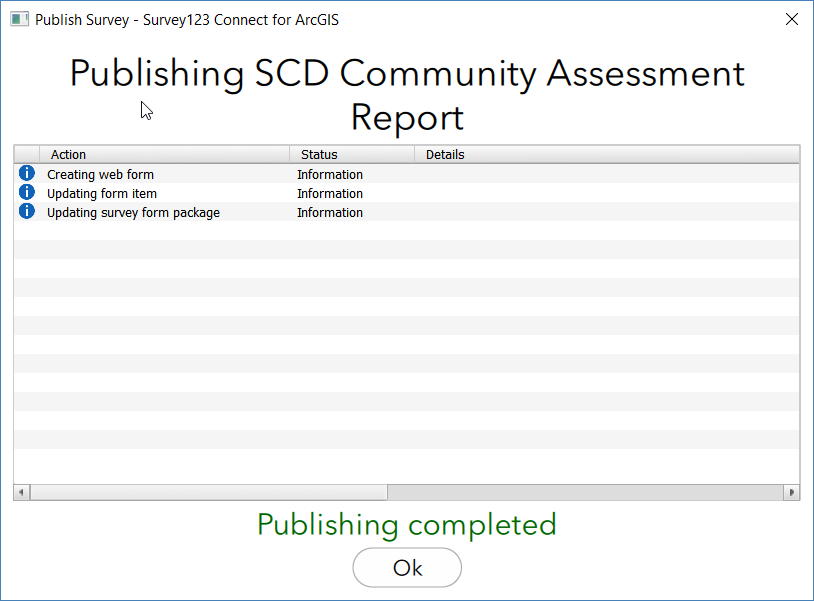 

3.  From the Feature Layer created, export the result as a GeoFile
    Database (Feature Layer Export FGDB). Save the export in the Survey
    directory created in the previous step.

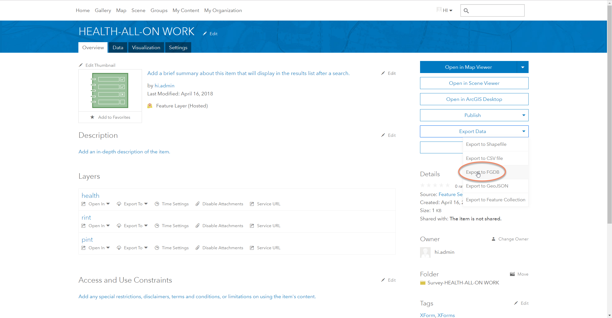

4.  After exporting, the item page automatically opens. Download the
    FGDB as a zip file.

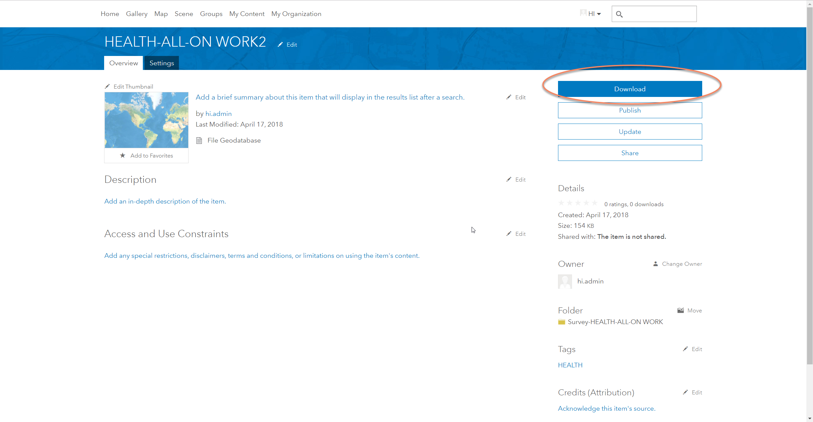

5.  Copy the downloaded zip file to the server (on which the Portal and
    geodatabase are running) and extract the files (typically to a
    directory like: IMSMA Workspace\\Filegeodatabase)

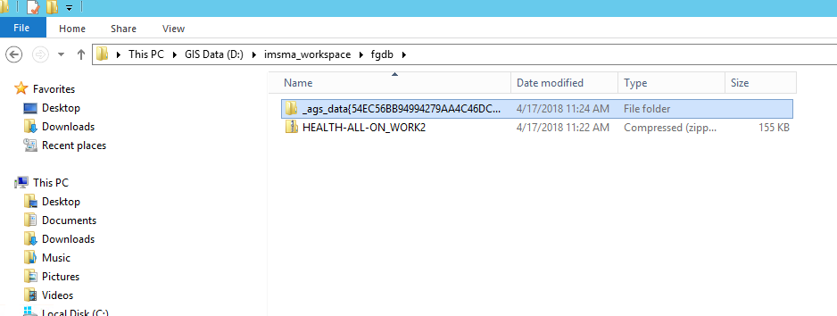

6.  Open the FGDB with ArcCatalog.

7.  Manually delete the relationship and attachment tables.

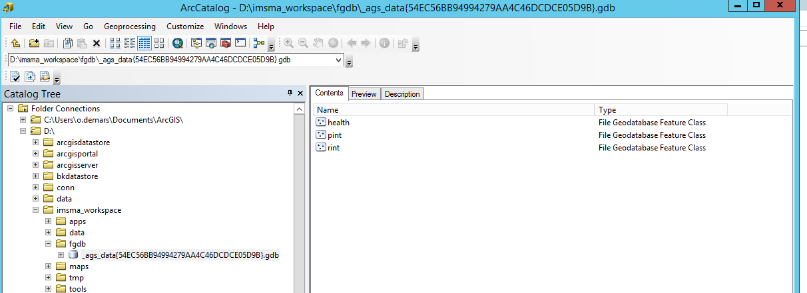

8.  Rename all the domains to cvd\_\<name\>, where \<name\> is the name
    of the domain. (This basically means deleting whatever is in front
    of "cvd\_".). Right click on the FGDB and click on Properties.

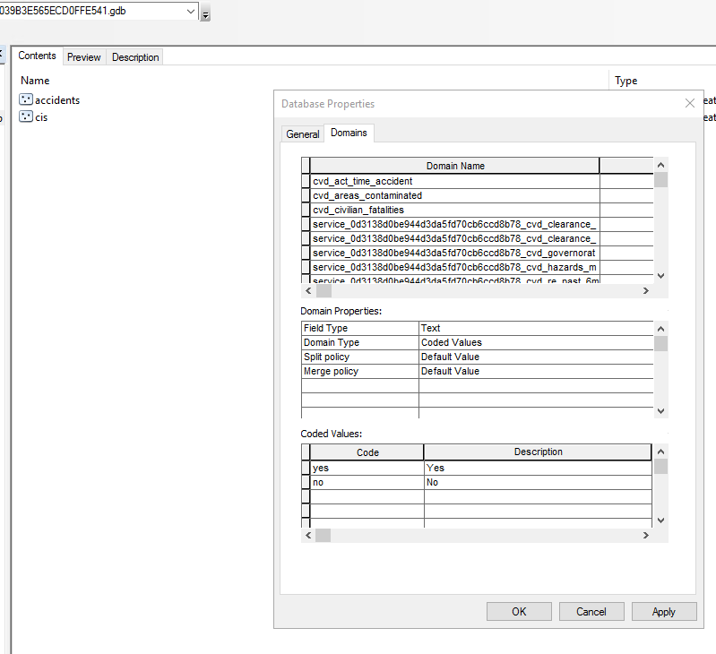

9.  Copy the remaining tables to the IMSMA Core geodatabase
    (copy-paste).

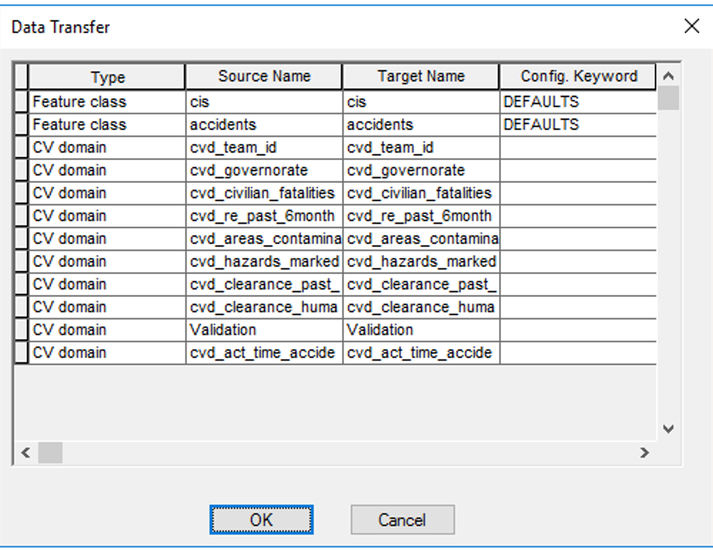

10. For each table, enable the archiving (Manage Enable Archiving).

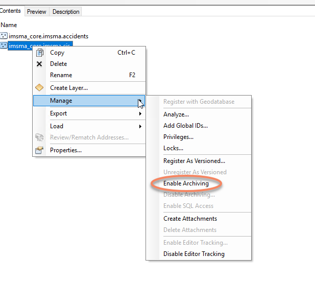

11. If there is a sub-table (e.g. devices): Open the ArcToolbox in
    ArcCatalog and choose the tool "Create Relationship Class" under
    Data Management Tools and Relationship Classes, type: COMPOSITE,
    specify uniquerowid and parentrowid.

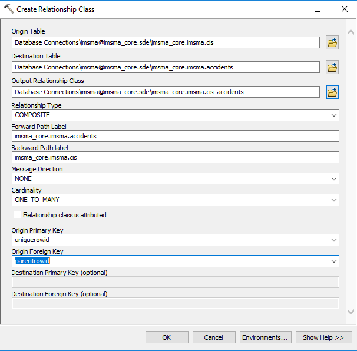

12. On all relevant tables, re-create the attachment table (Manage
    Create Attachments).

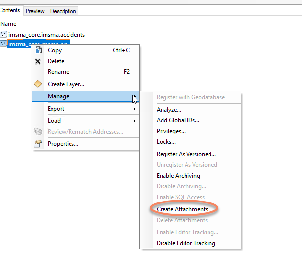

13. Close ArcCatalog and open ArcPro.

14. Connect the database to your project

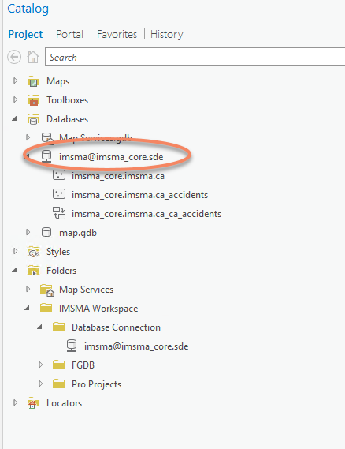

15. Prepare a map containing the newly created data.

    -   rename the layers to reflect the names of the DB tables

    -   choose a symbology

    -   if needed, add definition query

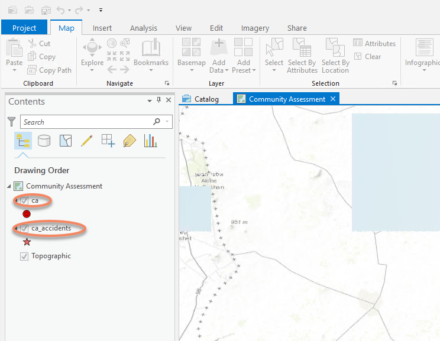

16. Publish the map to the Portal. Share -\> Web Layer -\> Publish New
    Service

    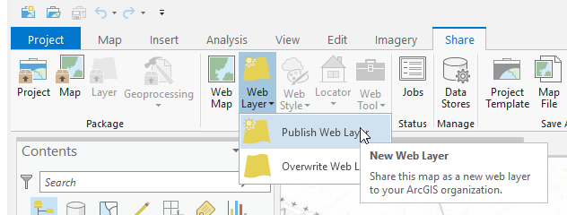
    

> In the Share As Web Layer (see screenshot below):

-   Choose a feature Name, a folder can be specified (this will be the
    folder used at the Server and Portal level)

-   Choose Reference registered data

-   Select Feature as a layer type

-   Provide a Summary

-   Add Tags

-   Choose the Groups the feature layer needs to be shared with

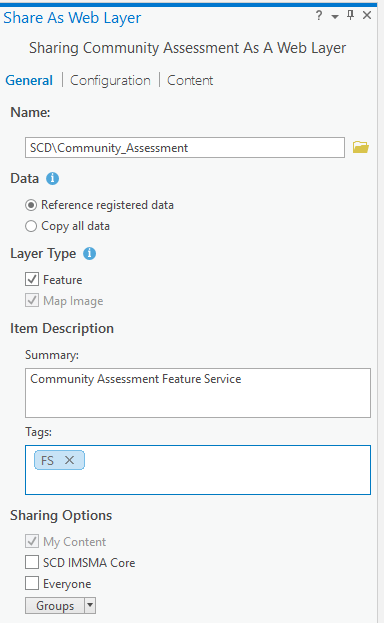

> In the Feature Properties, Configuration tab (see screenshot below):

-   Choose if the data can be added, updated or deleted

-   Enable Sync if needed (important for Collector offline map)

-   Enable Export of Data

-   Allow or not geometry update

    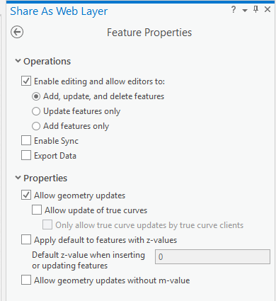
    

17. Get the submission url

a.  Open https://\<your\_portal\>/portal/sharing/rest

b.  Login as admin user

c.  Go to "Home" (link on the top of the page)

d.  Go to "Search"

e.  Search for the feature layer

f.  In the result set, there are usually two links. Try them both and
    check which one is of type "Feature Service". Copy the URL (not the
    value of the field "url", but the URL that appears in the browser)
    -- this is the submission\_url to be specified in the Survey123.

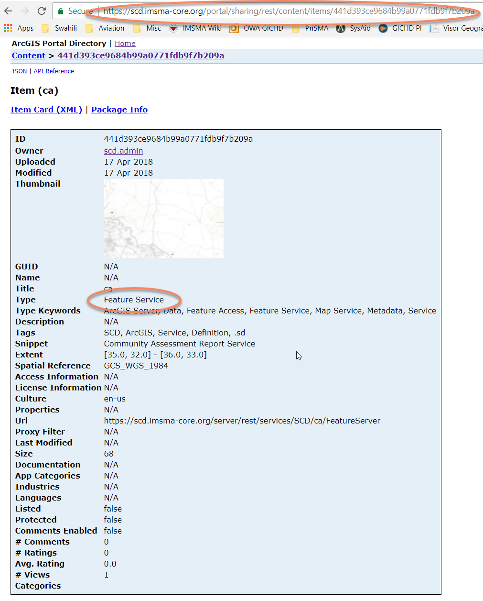

18. Finally, go back to the survey in Survey123 Connect and copy the URL
    in the "submission\_url" field of the "settings" tab.
