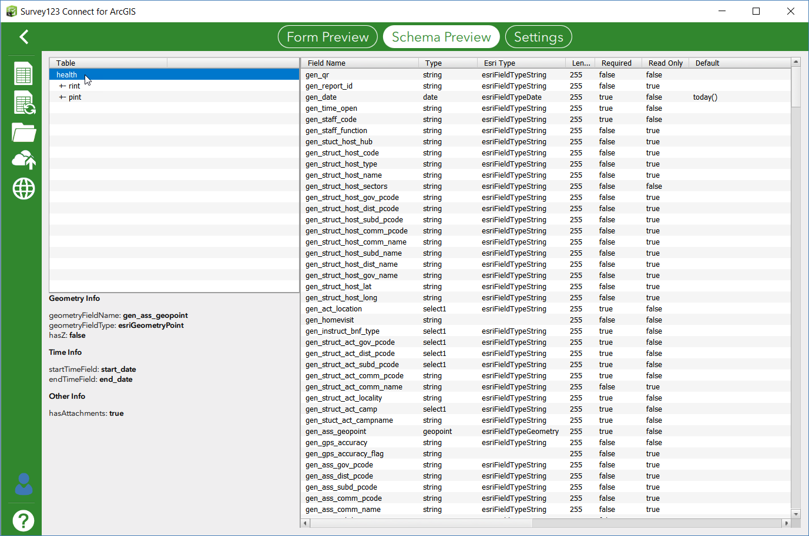
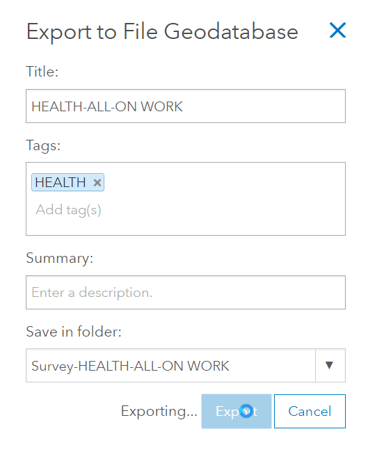
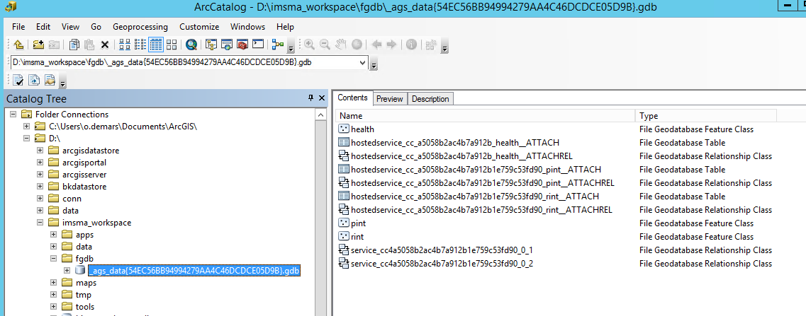
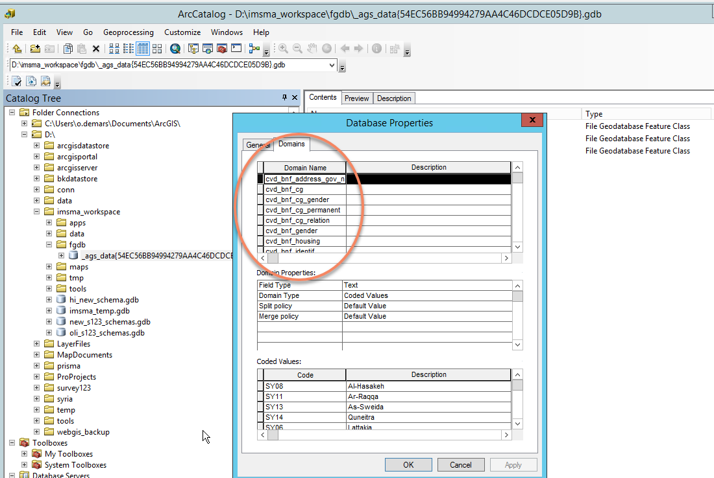

[Back to main menu](../index.md)  

Creating a geodatabase structure from a Survey123
======================

The following steps are required to transfer a structure defined in a
Survey123 form into a geodatabase:

1.  Check the Survey structure using Survey123 Connect Schema Preview
    feature. The following needs to be checked:

-   Field name: these names will be the name of the columns in the
    postgres table. They need to be 31 characters or less and be
    meaningful.

-   Esri Type: if a type is defined, a column will be created in the
    postgres table. If a field should not be created in the table, the
    null type must be used in the **bind::esri:fieldType** column in the
    Survey123 Excel file.

-   Length: as a rule, make sure all lengths are 255. This is
    particularly important for select\_one, it allows to add easily
    choices to published surveys.

2.  Publish the Survey containing the required structure from Survey123
    Connect

3.  From the Feature Layer created, export the result as a GeoFile
    Database (Feature Layer Export FGDB). Save the export in the Survey
    directory created in the previous step.

4.  After exporting, the item page automatically opens. Download the
    FGDB as a zip file.

5.  Copy the downloaded zip file to the server (on which the Portal and
    geodatabase are running) and extract the files (typically to a
    directory like: IMSMA Workspace\\Filegeodatabase)

6.  Open the FGDB with ArcCatalog.

7.  Manually delete the relationship and attachment tables.

8.  Rename all the domains to cvd\_\<name\>, where \<name\> is the name
    of the domain. (This basically means deleting whatever is in front
    of "cvd\_".). Right click on the FGDB and click on Properties.

9.  Copy the remaining tables to the IMSMA Core geodatabase
    (copy-paste).

10. For each table, create global IDs and enable the archiving (Manage
    Add Global ID, Manage Enable Archiving).

11. If there is a sub-table (e.g. devices): Open the ArcToolbox in
    ArcCatalog and choose the tool "CreateRelationshipClass", type:
    COMPOSITE, specify uniquerowid and parentrowid.

12. On all relevant tables, re-create the attachment table (Manage
    Create Attachments).

13. Close ArcCatalog and open ArcPro.

14. Prepare a map containing the newly created data. Comment: rename the
    layers to reflect the names of the DB tables.

15. Publish the map to the Portal. Comment: set all required features,
    such as "update" -- since this is going to be a layer to which data
    will be submitted.

16. Open to

    a.  Login as admin user

    b.  Go to "Home" (link on the top of the page)

    c.  Go to "Search"

    d.  Search for the feature layer

    e.  In the result set, there are usually two links. Try them both
        and check which one is of type "Feature Service". Copy the URL
        (not the value of the field "url", but the URL that appears in
        the browser) -- this is the submission\_url to be specified in
        the Survey123.

17. Finally, go back to the survey in Survey123 Connect and copy the URL
    in the "submission\_url" field of the "settings" tab.
