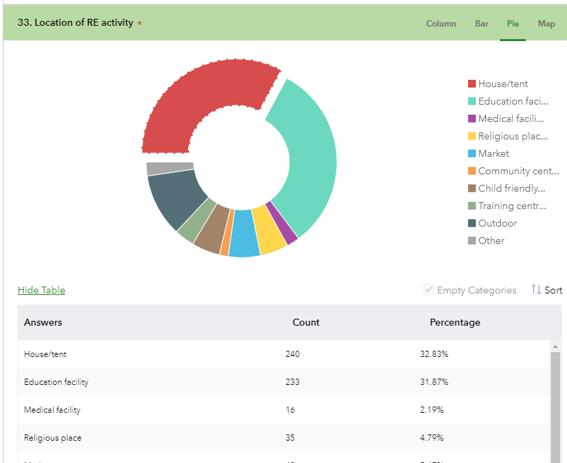
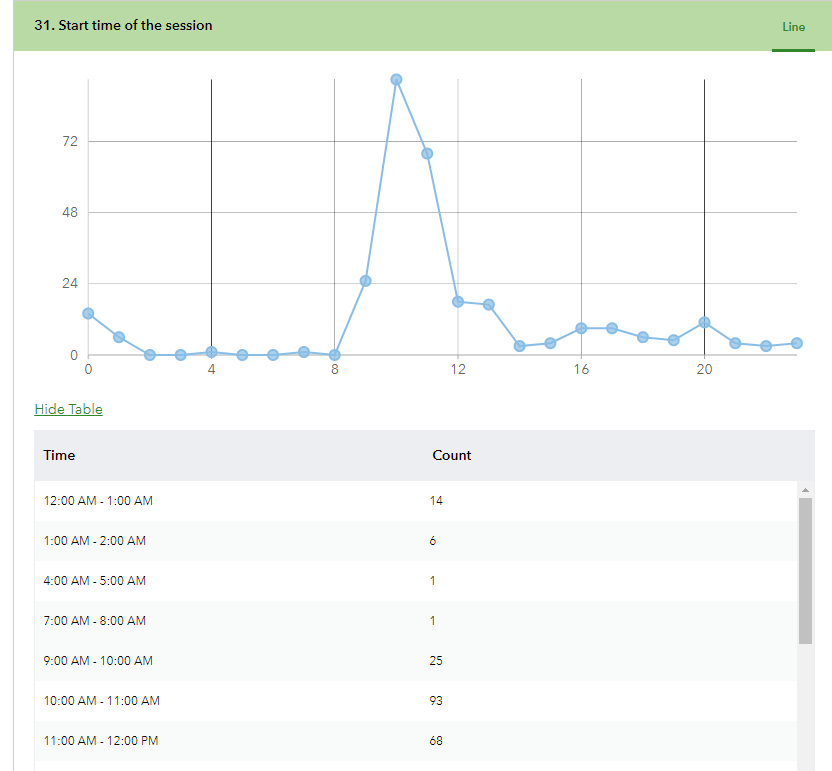
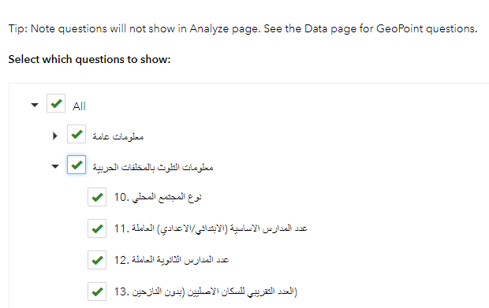
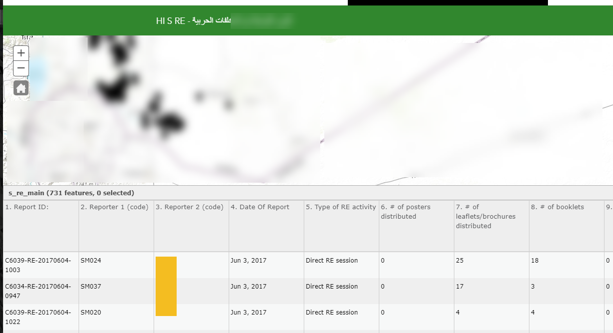
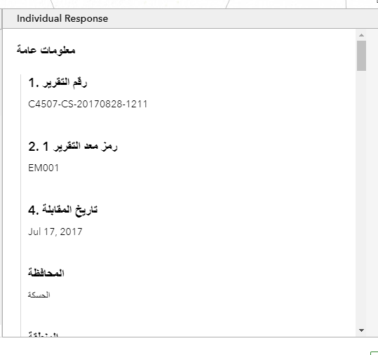

[Back to main menu](../index.md)  

Accessing the Survey123 Website
===============================

1.  Go to the Survey123 Website (currently
    <https://survey123.arcgis.com?portalUrl=https://imsma-core.esri.com/portal>
    but soon to be available with Portal as part of IMSMA Core)

2.  Sign in using your IMSMA credentials.

3.  After signing in you will see the surveys that have been published
    and

Tracking Responses to a Survey
==============================

When you go to the **Overview** tab of a given survey you will be able
to see the Total Records, Total Participants, First Submission Date, and
Last Submission Date.

You can also set a custom date range and see the count of surveys
submitted during that timeframe. The line chart will update based on the
custom date range.

Analyze Your Results
====================

When you go to the **Analyze** tab of a given survey, for each supported
question in your survey, you\'ll see one section with different types of
charts and optionally, a data table, which can reveal the trend of how
your respondents answer the question.

For Select One, Integer, and Decimal questions, charts (column, bar, and
pie), a map view, and a data table will be available.

To switch between the different data displays click the options in the
upper right of each question header.

To hide the table click the Hide Table option above the table. You can
also sort the table based on the selected attribute (A-Z or Z-A) and
toggle empty categories on and off in the Bar Chart view.

Date questions can be viewed as a histogram, and Time questions can be
viewed as a line.

Additionally, you can hide and show each question on the page by using
the **Set Visibility** dialog box to filter questions

View all the Survey Records
===========================

When you go to the **Data** tab of a given survey you can use the data
table to view all collected records in your survey.

The data table lists the answers to all questions using one column for
each question, each of which can be sorted ascending or descending. If
your survey uses repeat questions, the answers to those questions will
reside in a separate table, or as attachments.

Clicking a record will show related records and attachment files listed
below the main table. If you check **Show Individual Response**,
clicking a record will also show answers to all the questions for that
record, to the right of the table. Within the **Show Individual
Response** section you can also choose to **Print Individual Response**.
Note: currently the Individual Response section shows question titles in
the default language of the Form, not the alias for the question names.
This functionality has been requested as an enhancement for the
Survey123 Website.

