Authoring Maps on Portal
========================

What is a Web Map?
------------------

An ArcGIS web map is an interactive display of geographic information
that you can use to tell stories and answer questions. For example, you
may find or create a map that addresses the question, How many people in
the United States live within a reasonable walk or drive to a
supermarket? This map has layers showing which neighborhoods are within
a 10-minute drive or 1-mile walk to a supermarket, and for context, the
map has a topographic basemap that includes cities, roads, and buildings
overlaid on land cover and shaded relief imagery.

Maps contain a basemap, a set of data layers (many of which include
interactive pop-up windows with information about the data), an extent,
and navigation tools to pan and zoom. Many maps also contain scaled
symbols and other smart styling that reveal data as you interact with
it. For example, a map could show the relative magnitude of earthquakes
that happened over the previous 60 days.

Maps can be [created in a few basic
steps](http://server.arcgis.com/en/portal/latest/use/get-started-with-maps.htm) and
opened in standard web browsers, mobile devices, and desktop map
viewers. They can
be [shared](http://server.arcgis.com/en/portal/latest/use/share-maps.htm) through
links, embedded in websites, and used to [create map-based web
apps](http://server.arcgis.com/en/portal/latest/use/create-map-apps.htm).
When a map is shared, the author decides what to include with the map.
For example, when the map is shared to the general public through the
map viewer, the map includes options to switch basemaps, view a legend
(if the map contains one), view details about the map, share, print,
measure, and find locations on the map. Signing in to the map viewer
with an ArcGIS account may reveal additional options for adding layers,
performing analysis, getting directions, and so on. Maps embedded in
websites and shared through apps often contain a focused set of tools
for a specific purpose, such as collecting information, editing
features, or comparing two maps side-by-side.

Web maps can be used across ArcGIS because they adhere to the same [web
map
specification](http://links.esri.com/agol-help/web-map-spec).
This means you can create web maps in one ArcGIS app and view and modify
them in another. For example, you can create a web map in ArcGIS Pro and
your colleague can modify it in ArcGIS Online.

[http://server.arcgis.com/en/portal/latest/use/what-is-web-map.htm](http://server.arcgis.com/en/portal/latest/use/what-is-web-map.htm)

Web Map Key Components
----------------------

The following are the key components that make up web maps.

### Basemaps

A basemap provides a background of geographical context for the content
you want to display in a map. When you create a new map, you can choose
which basemap you want to use. You can change the basemap of the current
map at any time by using the basemap gallery or using your own layer as
the basemap. You can also create a basemap containing multiple layers
from the **Contents** pane in the map viewer. [Learn more about
basemaps](http://server.arcgis.com/en/portal/latest/use/choose-basemap.htm).

### Layers

Layers are the contents of your story. They can include topics related
to people, Earth, life, and imagery. You can add one layer or multiple
layers. By bringing together multiple layers, or data sources, into a
single map, you can help tell a more interesting story. Be careful,
however, that you don't add too many things to one map and make it hard
to read. In addition, it may help your audience understand your map if
you add some features that are not part of an existing layer. For
example, you might want to add in some photos and captions within a
recent fire perimeter. You can add features by adding a map notes layer
or importing features from a file. [Learn more about
layers](http://server.arcgis.com/en/portal/latest/use/add-layers.htm).

### Cartography/Style

Geographic data can be styled many different ways on a map. When you
want to change the way your layer is styled, you are presented with
different ways to style the data along with options for each of those
choices. The choices you see will change based on properties of the data
itself. You can choose different symbols to represent the features
you\'ve added to your map. For example, water bodies and streams might
be shown with a single, constant blue color. Roads might be symbolized
based on road class. Seismic events, such as earthquakes, might be
represented using graduated symbols based on their magnitude, and
polygons might be classified based on land use. [Learn more about
styles](http://server.arcgis.com/en/portal/latest/use/change-style.htm).

### Pop-ups

Pop-ups bring to life the attributes associated with each feature layer
in the map, such as hiking trails, land values, or unemployment rates.
They can show attachments, images, and charts and can link to external
web pages. The default pop-up appearance for a layer is a plain list of
attributes and values. You can [configure the
pop-ups](http://server.arcgis.com/en/portal/latest/use/configure-pop-ups.htm) to
define the list of visible and hidden fields and how to present that
information. For example, you might show a list of attributes or provide
a rich interactive experience for visualizing and comparing features in
a particular layer by providing custom-formatted text and charts

Steps to Create a Map
---------------------

1.  Sign in to the IMSMA Core Portal.

    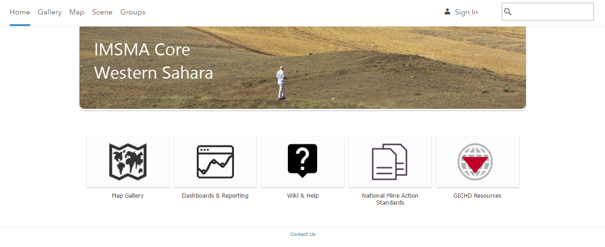

2.  Click on **Map**.

Select a Basemap
----------------

1.  Click **Basemap**.

a.  Click the thumbnail of the basemap you want to use in your map.

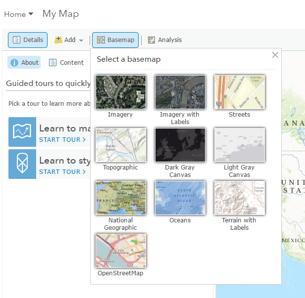

2.  Under **Details** and click **Content**.

3.  Click the basemap name, click **More Options** , and click **Description**.

4.  Click back to the tab/window with the map.

5.  Click **Save** to save the new basemap to the map.

6.  Enter a title, tags (searchable keywords) and description for the
    map.

7.  Click **Save Map**.

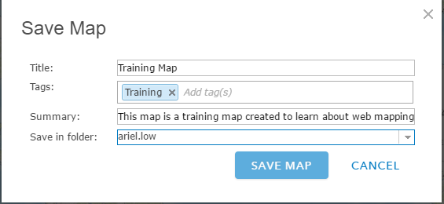

Add Layers to the Map
---------------------

### Search for Layers

1.  Click **Add**, then click **Search for Layers.**

2.  Enter keywords within the **Find** field.

3.  Choose where you want to search for layers---your portal, **ArcGIS
    Online**, **A GIS server**, **My Favorites**, **My Content**, or
    groups you belong to.

    a.  If your portal is configured to access content from Living Atlas
        of the World, you will also have the option to search **Living
        Atlas Layers**.

4.  Uncheck **Within map area** if you don\'t want the results to be
    based on your current map extent. (Leave the box checked if you want
    the results to be based on your current map extent.)

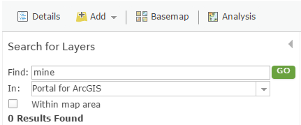

5.  Click **Go**. A list of layers that relate to the keywords you
    entered appears.

6.  Click a title to see a pop-up summary of the layer, or
    click **Add** to the right of the title to add the layer to your
    map.

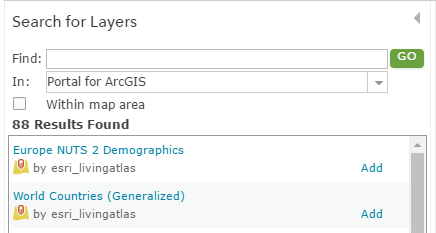

7.  When you finish adding layers, click **Done Adding Layers** to close
    the **Search for Layers** panel.

### Browse Living Atlas Layers

1.  Click **Add**, then **c**hoose **Browse Living Atlas Layers** to
    open a gallery of layers.

2.  The gallery is based on the current extent of your map.
    Uncheck **Within map area** if you don\'t want the results to be
    based on your current map extent.

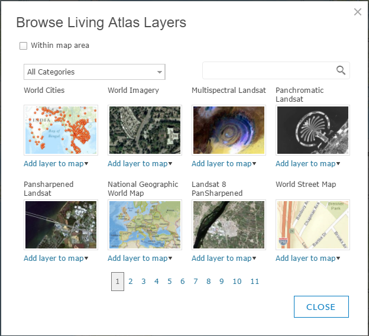

3.  Find the layer you are interested in:

    -   Choose a category of layers such as imagery or people.

    -   Use the keyword-based search to find a specific layer.

    -   Page through all the available layers.

    -   Hover over a thumbnail to see a description of the layer.

4.  Click **Add To Map** and **As Layer** or **As Basemap** to add the
    layer to your map.

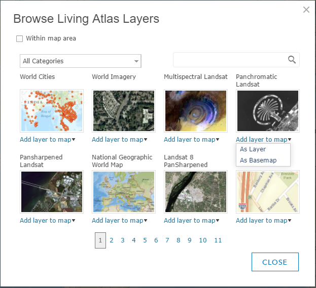

### Add Layers from the Web

You can add the following types of layers through a URL: [ArcGIS Server
web
service](http://server.arcgis.com/en/portal/latest/use/add-layers.htm#ESRI_SECTION2_314AA95D5A074ACD91AA6AA1DD9F9E5C), [OGC
WFS web
service](http://server.arcgis.com/en/portal/latest/use/add-layers.htm#ESRI_SECTION2_49E839B2BE9C455FB6E50887BF96CDAC), [OGC
WMS web
service](http://server.arcgis.com/en/portal/latest/use/add-layers.htm#ESRI_SECTION2_C34EB22293D94DEAA28712CAF132A78B), [OGC
WMTS web
service](http://server.arcgis.com/en/portal/latest/use/add-layers.htm#ESRI_SECTION2_97BAAF75132F4D6E9A43EBE0F10C0007), [Tile
layer](http://server.arcgis.com/en/portal/latest/use/add-layers.htm#ESRI_SECTION2_2C913FF2022B4DD29BF9DA6CB6014EDB), [KML
file](http://server.arcgis.com/en/portal/latest/use/add-layers.htm#ESRI_SECTION2_739FD1CC71AE4EC999F51B752186F67D), [GeoRSS
file](http://server.arcgis.com/en/portal/latest/use/add-layers.htm#ESRI_SECTION2_D291DA63878141B291ECF3FC4CC692FE),
and [CSV
file](http://server.arcgis.com/en/portal/latest/use/add-layers.htm#ESRI_SECTION2_E2F7001A034942B7925686E01C839A7E).
If your organization is configured for Bing Maps, you can also
add [Bing Maps
basemaps](http://server.arcgis.com/en/portal/latest/use/add-layers.htm#ESRI_SECTION2_758AE7D53057403FB9CA27FCABE174CA).

1.  Click **Add**, then click **Add Layer from Web**.

2.  Choose **An ArcGIS Server Web Service** and enter the layer\'s web
    address in the **URL** field.

    ArcGIS Server web service URLs are in the format **https://\<server
    name\>/arcgis/rest/services/folder/\<service name\>/\<service
    type\>**. If the service is in the root folder, you do not need to
    include the folder name in the URL. The URL format in that case
    is **https://\<server name\>/arcgis/rest/services/\<service
    name\>/\<service type\>**.
>
    For example, to connect to an ArcGIS Server map service, you would
    type a URL similar to the
    following: **https://myserver.com/arcgis/rest/services/service/MapServer**. For
    more information and examples, see [Components of ArcGIS
    URLs](http://server.arcgis.com/en/portal/latest/administer/windows/components-of-arcgis-urls.htm) in
    the Portal for ArcGIS Administrator Guide.
>
    If you need to access your service over HTTPS, add your layer
    with **https**.

3.  If you want to use the layer as a basemap, check **Use as Basemap**.

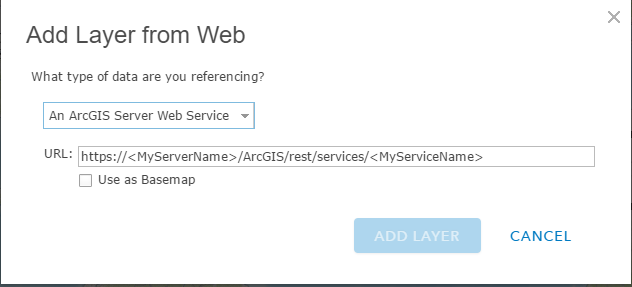

4.  Click **Add Layer** to add the layer to your map.

5.  Click **Save** to save the Web Map with the new layers.

### Change the Layer Style

1.  Browse to and hover over the feature layer that contains the style
    you want to change and click **Change Style** 
    .

2.  Choose an **attribute to show**.

3.  To apply multiple styles, click **Add attribute** and choose a
    second **attribute to show**.

4.  Choose a style based on what you want to show. For help choosing a
    style, refer to the [Change Style quick reference
    table](http://server.arcgis.com/en/portal/latest/use/change-style.htm#TABLE_29D47BB5EA474D1F8778BB0D032817C2).

    ***Note:** Only the options that apply to your data appear. For
    example, if you only know the location of a feature, you can only use
    a single symbol or heat map but not size or color. However, if you
    have categorical or numeric information attached to those locations,
    smart mapping presents many other styling choices.*

5.  The blue bar indicates the current styling of the layer.
    Click **Select** to choose a different style.

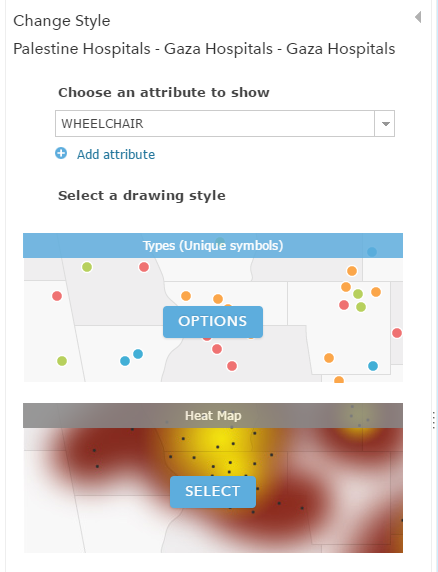

6.  Click **Options** to customize the look of the layer.

    ***Tip:** With [Color &
    Size](http://server.arcgis.com/en/portal/latest/use/change-style.htm#ESRI_SECTION1_5746532688614A4C805AACCBFE18BD0C) and [Types
    &
    Size](http://server.arcgis.com/en/portal/latest/use/change-style.htm#ESRI_SECTION1_29829A2CC31649F7B7E0CA2095267B8D),
    you apply styling options to each attribute. For example, if you
    choose the **Types & Size** style, choose options for [Types (Unique
    symbols)](http://server.arcgis.com/en/portal/latest/use/change-style.htm#ESRI_SECTION1_1084DA17FD3C470B87A004AB55132D38) and
    for [Counts and Amounts
    (Size)](http://server.arcgis.com/en/portal/latest/use/change-style.htm#ESRI_SECTION1_872438351B424ECE9B435B47F6E7432F).*

7.  Click **OK** when you are finished customizing your style or
    click **Cancel** to go back to the **Change Style** pane without
    saving any of your choices.

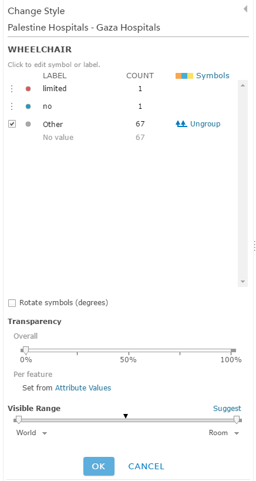

8.  If you
    have [privileges](http://server.arcgis.com/en/portal/latest/use/roles.htm) or
    the [item update
    capability](http://server.arcgis.com/en/portal/latest/use/share-items.htm#ESRI_SECTION1_00626E637AF7465E88733B3E29C121DA) to
    apply changes to the layer and want the styling to apply to the item
    anytime it appears in a map, browse to the layer you want to save,
    click **More Options** 
    , and click **Save Layer**.

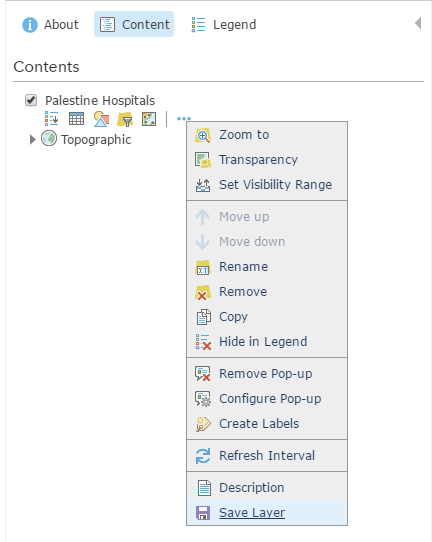

9.  Click **Save** from the top of the map viewer to save the styling
    changes to the map.

Using Pop-ups
-------------

A map can show descriptive information about features configured
to [display in a
pop-up](http://doc.arcgis.com/en/arcgis-online/use-maps/view-pop-ups.htm).
They can
show [attachments](http://doc.arcgis.com/en/arcgis-online/create-maps/configure-pop-ups.htm#ESRI_SECTION1_E563DC86D0864BAA9F2FDE0C78EF7389), [images](http://doc.arcgis.com/en/arcgis-online/create-maps/configure-pop-ups.htm#ESRI_SECTION1_B16A9E11A48D48CBAFA9DB964FCEB805),
and [charts](http://doc.arcgis.com/en/arcgis-online/create-maps/configure-pop-ups.htm#ESRI_SECTION1_F3128B6FDFA94ACF89F4F2A283F2D66A) and
can link to external web pages. You can [configure pop-ups on
imagery](http://doc.arcgis.com/en/arcgis-online/create-maps/configure-pop-ups.htm#ESRI_SECTION1_039AEBEB52B54B23B7B28339C6B6DDB1) when
you\'re working with a mosaic dataset-based image service. A pop-up on
an image layer displays the attributes of images at its current
location, such as the acquisition date, sensor type, and cloud cover.

### Enabling Pop-ups

1.  Open the map in the map viewer, click **Details**, and
    click **Contents**.

2.  Browse to the sublayer that contains the feature data you want to
    show in a pop-up, click **More Options** 
    , and click **Enable Pop-up**.

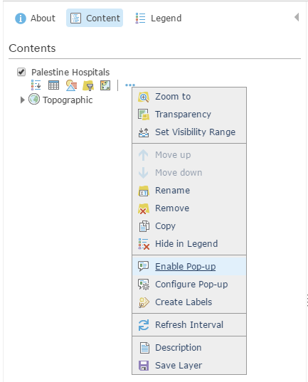

3.  If you do not want to display pop-ups for a layer you have
    previously enabled, browse to the feature layer, click **More
    Options** 
    , and click **Remove Pop-up**. There
    is no option to remove pop-ups for map notes or KML layers.

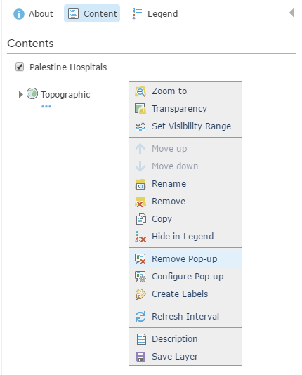

### Configuring Pop-ups

1.  Open the map in the map viewer, click **Details**, and
    click **Contents**.

2.  Browse to the sublayer that contains the feature data you want to
    configure in a pop-up, click **More Options** 
    , and click **Configure Pop-up**.

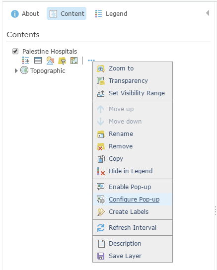

3.  Enter a title for your pop-up.

    1.  Use the **\[+\]** button to select field values from your data.
        The field values contain field aliases followed by the field
        names. By default, the primary field is displayed.

2.  Optionally enter static text instead of or in addition to your field
    values.

<!-- -->

4.  Select an attribute option from the drop-down menu to set the
    contents for the pop-up. Your choices are a list of field
    attributes, a description from one field, a custom attribute
    display, or no attribute information. If your layer contains related
    fields, you can configure the pop-up to [show related records in a
    table](http://doc.arcgis.com/en/arcgis-online/create-maps/configure-pop-ups.htm#ESRI_SECTION1_09B2E0D22072457AAC8D025377DD7CF9).

    3.  To configure the attributes within the field or fields you want
        to display, click the **Configure Attributes** link.

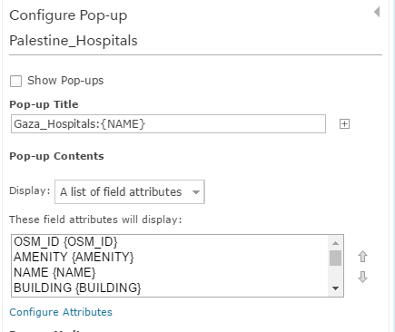

1.  Select which fields you want to display. You can also select a field
    to change its alias, order it, and format it. For number fields
    (such as population), select the number of decimal places to display
    and whether to use a 1,000 separator.

    ***Tip:** If the layer supports editing, you can select which fields
    to edit. Be sure to also display the field (so it appears in the edit
    pop-up). For editable text fields, you can select the type of text box
    and provide a hint.*
>
    *For date fields that include time, select a format that includes
    both. By default, only dates are displayed.*

4.  If you selected to show a description from one field, click the
    arrow under **Select the field containing the description** and
    click a field name to display.

5.  If you\'ve selected a custom attribute display,
    click **Configure** to define and format the information you want to
    show. The custom attribute display allows you to use a combination
    of rich text, attributes, links, and [supported
    HTML](http://doc.arcgis.com/en/arcgis-online/reference/supported-html.htm) to
    give you the most control and flexibility over your display. If you
    create a custom attribute display for an editable layer, the
    attributes appear as a list when someone edits the feature.

5.  If your feature layer includes attachments, you can select to [show
    attachments](http://doc.arcgis.com/en/arcgis-online/create-maps/configure-pop-ups.htm#ESRI_SECTION1_E563DC86D0864BAA9F2FDE0C78EF7389) as
    links at the bottom of the pop-up. Attachments are supported as a
    related table to a feature class in a feature service.

6.  Add media to your pop-up if you want, such
    as [images](http://doc.arcgis.com/en/arcgis-online/create-maps/configure-pop-ups.htm#ESRI_SECTION1_B16A9E11A48D48CBAFA9DB964FCEB805) or [charts](http://doc.arcgis.com/en/arcgis-online/create-maps/configure-pop-ups.htm#ESRI_SECTION1_F3128B6FDFA94ACF89F4F2A283F2D66A).

7.  Click **OK** when you are finished configuring your pop-ups.

8.  Click **Save Layer** to [save the configuration as a property of
    the
    item](http://doc.arcgis.com/en/arcgis-online/create-maps/copy-save-layers.htm).
    You can only save item properties if you own the layer or if you
    save it as a new item.

9.  []{#_gjdgxs .anchor}Click **Save** from the top of the map viewer to
    save the pop-up changes to the map.
