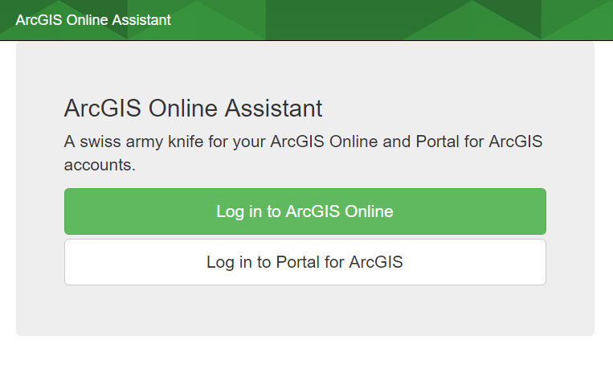
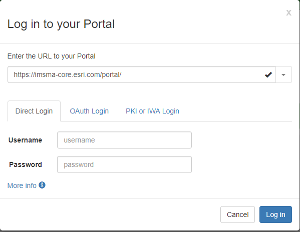
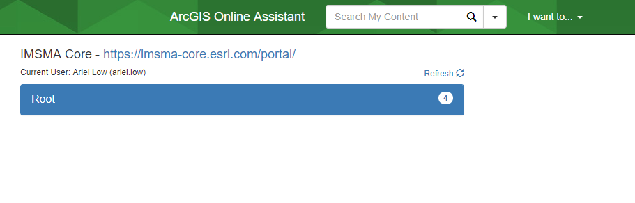
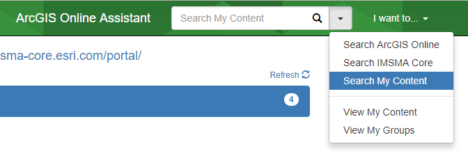
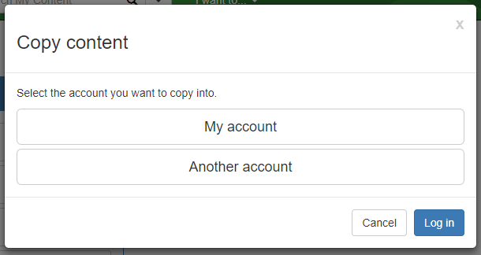
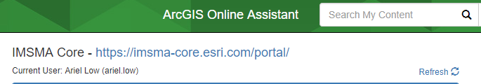
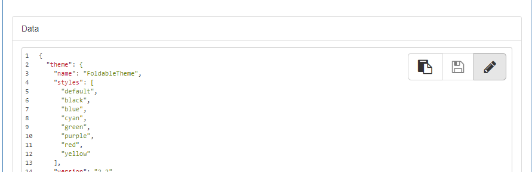
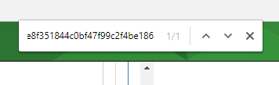
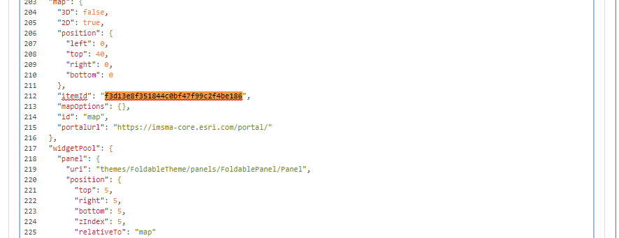

[Back to main menu](../index.md)  

Copying Items with AGO Assistant
================================

ArcGIS Online Assistant can be used to interact with items in your
ArcGIS Online or Portal organization in ways that the traditional user
interface does not support. Key pieces of functionality that AGO
Assistant supports are as follows:

-   **Inspect** - View the underlying JSON for any item in ArcGIS Online
    or your Portal.

-   **Update** - Modify the URLs for services in web maps and registered
    applications.

-   **Copy** - Search for and copy content to your account and other
    accounts.

Accessing AGO Assistant
-----------------------

1.  Go to
    [https://ago-assistant.esri.com/](https://ago-assistant.esri.com/)

2.  Choose **Log in to Portal for ArcGIS**

    

3.  Enter the URL for the IMSMA portal
    [https://imsma-core.esri.com/portal](https://imsma-core.esri.com/portal)

    

4.  Enter your credentials, then click **Log in**

Copying Content
---------------

AGO Assistant supports copying layers, web maps and web apps. In this
example we will be copying a web map and a web app, then pointing the
copied web app at the copied web map.

1.  Find the web map and web app you want to copy.

    -   If the item is in your content use the left side of the screen
        to view your content or search your content in the search bar.

    

-   To search other content click the down arrow next to the search bar
    and choose the area you would like to search.

    

2.  Once you have found the items you would like to copy click **I want
    to...** and then select **Copy Content**.

    

3.  Select whether you would like to copy content into the account you
    are logged in as (your account) or another account.

    -   If you choose another account you will be prompted for log in
        credentials.

    

4.  Drag the web map you would like to copy from the left side of the
    screen to the right side of the screen.

    

-   If it is successfully copied it will appear as green.

    

5.  Drag the web app you would like to copy from the left side of the
    screen to the right side of the screen.

    -   If it is successfully copied it will appear as green.

6.  Click **Refresh** on the left side above your content to see the
    newly copied items.

    

7.  Click **I want to...** then click **View an Item's JSON**.

    

8.  Click on the new copied web map in your contents.

    -   The second line of JSON for the item is its item id. Copy the id
        without the quotes and paste it in a notepad or word document on
        the side.

9.  Click on the original web map if it is in your content, search for
    it and then click on it if it is not in your content.

    -   Copy the item's id.

    

10. Click on the copied web app and scroll down to the data section then
    click the pencil icon.

    

11. Press Ctrl and F at the same time on your keyboard. Paste the id of
    the original web map into the search bar that opens in the upper
    right corner.

    

12. Replace the highlighted item id of the original map with the item id
    of the new copied map.

    

13. Use the up and down arrows next to the search bar to navigate to all
    the occurrences of the original item id and replace them with the
    new copied item id.

14. Once you have replaced all the original item ids scroll back to the
    top of the data section and click the save icon.

    

15. Go to the portal and confirm your copied web app is pointing at your
    copied web map and all the widgets are behaving as expected.

[Back to main menu](../index.md)  
