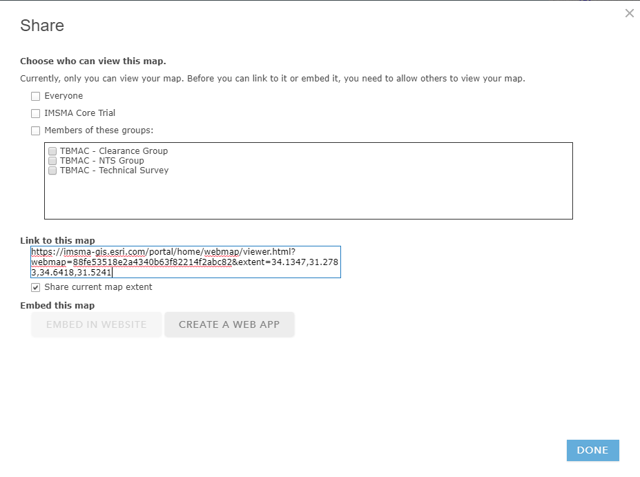
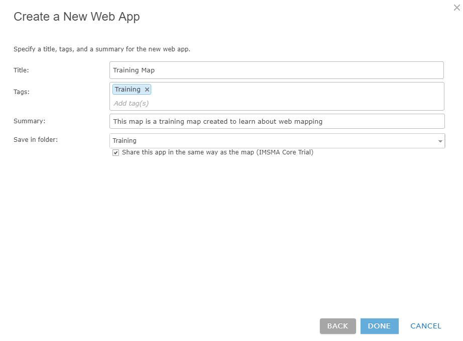
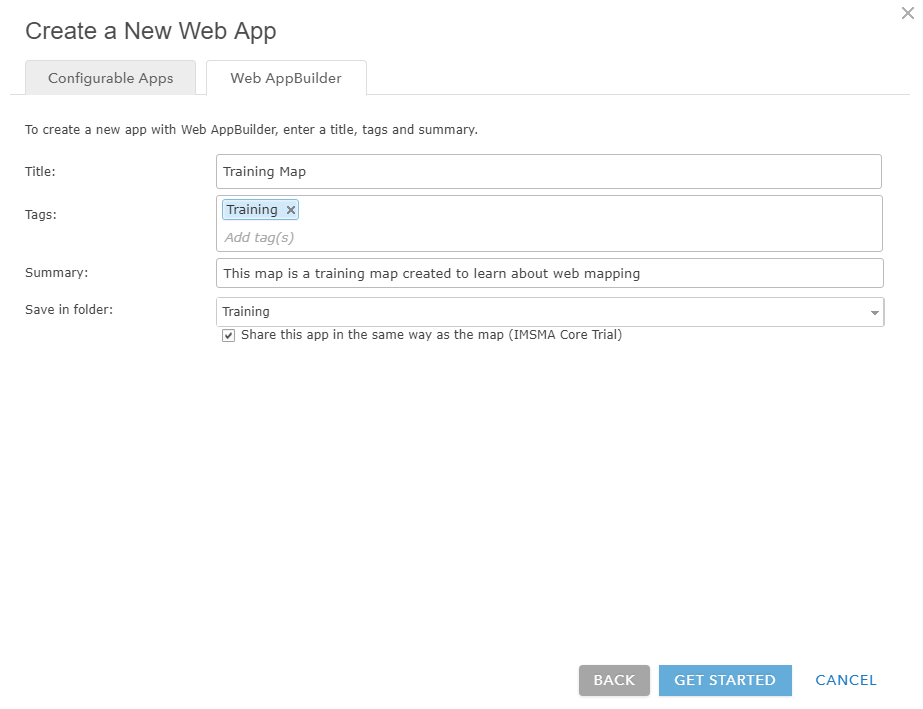
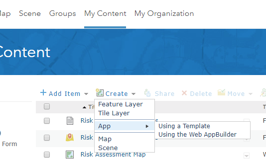
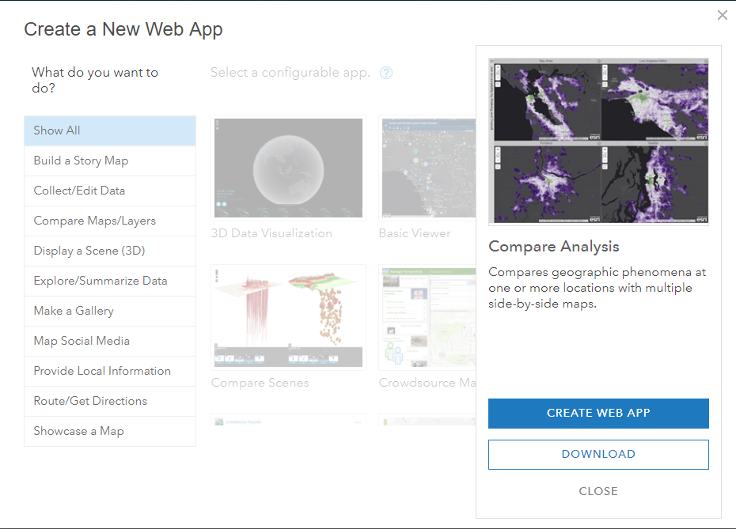

Create apps from maps
=====================

You can create a web app with a map by using a configurable app or [Web
App Builder](http://links.esri.com/WEBAPPBUILDER). Different
configurable apps and Web App Builder offer various bits of
functionality, such as different layouts and color schemes, editing and
identify tools, social media feeds, side-by-side map viewers, and so on.
You can choose a configurable app or open Web AppBuilder from: 

-   The [Map
    Viewer](http://doc.arcgis.com/en/arcgis-online/create-maps/create-map-apps.htm#ESRI_SECTION1_0A0E43463F304E60B556A670D1CCB6C1)

-   The [Gallery](http://doc.arcgis.com/en/arcgis-online/create-maps/create-map-apps.htm#ESRI_SECTION1_1308883F68B54B34B2DC6E9461874458)

-   [My
    Content](http://doc.arcgis.com/en/arcgis-online/create-maps/create-map-apps.htm#ESRI_SECTION1_7E1F85B1D480416692F6A9E8EB8F1ED5)

-   The [item
    page](http://doc.arcgis.com/en/arcgis-online/create-maps/create-map-apps.htm#ESRI_SECTION1_218B17C716B845F284D12271209D0088)

Then configure the components and publish the app. As an alternative,
you can [download a
template](http://doc.arcgis.com/en/arcgis-online/create-maps/download-app-templates.htm) and
deploy it to your organization\'s web server.

A published web app is based on a map authored with Map Viewer. Any
changes the author makes to the map, including its extent, layers,
description, and so on, are reflected in the web app. If a map that was
available to everyone in the organization is made private (or deleted),
the map no longer appears in the app.

Create an app starting from Map Viewer
--------------------------------------

To create an app starting from Map Viewer, follow the steps below.

1.  Open a saved map in Map Viewer and click **Share**.

        
    

2.  Click **Create A Web App**.

        
    

    The **Share** pop-up opens with two tabs: **Configurable
    Apps** and **Web AppBuilder**.

        
        

3.  To use a configurable app, stay on the **Configurable Apps** tab and
        do the following:

    a.  Choose what you want the app to do.

    b.  By default, all apps are shown, but you can use the filters in
        the panel to narrow your search.

        
    

c.  Click a thumbnail to see a description of the app and click **Create
    App** to start configuring your app.

      
    

d.  Type a title, tags, and a summary for your app and choose the folder
    in which to save the app.

e.  If you want to immediately share this app, click **Share this app in
    the same way as the map**. If you do not check this, you\'ll need to
    specify how to [share the
    app](http://doc.arcgis.com/en/arcgis-online/share-maps/share-items.htm) from **My
    Content**.

        
    

f.  Click **Done** to publish the app.

<!-- -->

4.  To use [Web AppBuilder](http://links.esri.com/WEBAPPBUILDER), do the
    following:

    a.  Click the **Web AppBuilder** tab.

        
    

b.  Type a title, tags, and summary for your app and choose the folder
    in which the app will be saved.

c.  Choose whether to apply the same sharing properties to the app as
    you have on the map.

        
    

d.  Click **Get Started** to open Web AppBuilder and continue creating
    your app.

Create an app starting from the content page
--------------------------------------------

To create an app starting from the content page, follow the steps below.

1.  From the **My Content** tab of the content page, click **Create**,
    and hover over **App**.

        
    

2.  To use a configurable app, click **Using a Template** and do the
    following:

    a.  Choose a configurable app.

        
    

b.  Click a thumbnail to see a description of the app and click **Create
    App** to start configuring your app.

        
    

c.  Type a title, tags, and a summary and, optionally, select a
    different folder to save your app.

        
    

d.  Click **Done** to publish the app.

<!-- -->

3.  To use [Web AppBuilder](http://links.esri.com/WEBAPPBUILDER),
    click **Using the Web AppBuilder** and do the following:

        
    

e.  Select **2D** or **3D**

f.  Type a title, tags, and a summary and, optionally, select a
    different folder to save your app.

        
    

g.  Click **OK** to open Web AppBuilder and continue creating your app.

Create an app starting from the item page
-----------------------------------------

To create an app starting from the item page of a map, follow the steps
below:

1.  From the **My Content** tab of the content page, open the item page
    of the map you want to use to create an app.

2.  To create a configurable app, click **Create App \> Using a
    Template** and do the following:

        
    

a.  Choose a configurable app.

b.  Click a thumbnail to see a description of the app and click **Create
    App** to start configuring your app.

        
    

c.  Type a title, tags, and a summary and, optionally, select a
    different folder to save your app.

        
    

d.  Click **Done** to publish the app.

<!-- -->

3.  Your app is published to ArcGIS Online and an
    unshared item is added to **My Content**. (To make your app
    accessible to others, you need to [share
    it](http://doc.arcgis.com/en/arcgis-online/share-maps/share-items.htm).)

4.  To use [Web AppBuilder](http://links.esri.com/WEBAPPBUILDER),
    click **Create App \> Using the Web AppBuilder** and do the
    following:

    e.  Type a title, tags, and a summary and, optionally, select a
        different folder to save your app.

        
    

f.  Click **OK** to open Web AppBuilder and continue creating your app.
