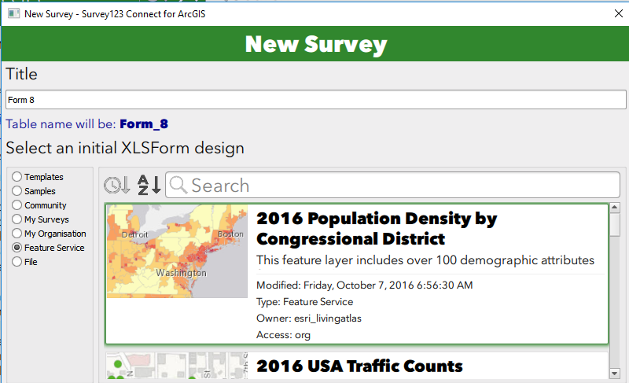

Creating a Survey123 Form from an Existing Feature Service
==========================================================

There are times when a survey will need to be created on top of an
existing feature service. Some reasons why this may need to happen
include: utilizing services that are pointing at commercial databases,
using existing data, creating multiple surveys pointing at one feature
service.

There are certain limitations with mapping the
ArcGIS geodatabase model to an XLSForm, many of which present themselves
when working with repeats. If your feature service has repeats (related
tables) in it please refer to this
[blog](https://geonet.esri.com/groups/survey123/blog/2017/09/25/working-with-existing-feature-services-in-survey123-for-arcgis)
in addition to this document.

How to Create a Survey on an Existing Feature Service
-----------------------------------------------------

1.  Open Survey123 Connect and click **New Survey**.

    

2.  Select **Feature Service** and search for the feature service you
    would like to use to build your survey.

    

-   Note: you will see feature services that have line and polygon
    geometries, be sure to select only a feature service with a point
    geometry.

3.  Give your survey a title and click **Create Survey**.

Survey123 Connect then looks at your feature service, checking all
fields, related tables and geodatabase domains. A new XLSForm will be
created for you as a starting point for your survey, the initial XLSForm
design.

The Initial XLSForm Design
--------------------------

Survey123 Connect will add a new question to your initial XLSForm design
for every field in the first layer of your feature service.  The
questions will be added to the *survey* XLSForm worksheet in the
same order as fields in your feature layer.

The initial XLSForm design assigns the XLSForm question types based on
the corresponding feature layer field type, according to the following
table:

 

 
 | **Feature layer field type**   | **Question type in initial XLSForm design** |
 | --- | --- |
 | esriFieldTypeInteger           | text |
 | esriFieldTypeDouble            | decimal |
 | esriFieldTypeString            | integer |
 | esriFieldTypeDate              | datetime |
 | esriFieldTypeGeometry (point)  | geopoint |
 | esriFieldTypeGUID              | text |

 

There are some notable exceptions to the rule above.

 

-   First, reserved fields in your feature layer will not be added to
    your XLSForm: ObjectID, GlobalID and Editor Tracking Fields will be
    ignored.

-   If your layer includes attachments, a single new *image* question
    will be added to your XLSForm.

-   Fields in your feature layer that have a coded value domain will be
    modeled as *select\_one* questions and the corresponding coded
    values will be automatically added as a list in the choices
    worksheet.

In the event that the first layer in your feature service is related to
other layers or standalone tables, you will see the presence
of *repeats* in the XLSForm.  In Survey123 related geodatabase
relationships are modeled as *repeats*.  The *name* of the *repeat* will
be defined by the table name of the related table or layer and cannot be
changed. Within the XLSForm *repeat* block, you will find questions
corresponding to the fields found in the related child table. The rules
for how questions are added within a repeat are exactly the same as for
questions in the main feature layer.

The columns with information based on the feature service in the initial
XLSform design are as follows:

-   Survey Sheet:

    -   Type

    -   Name

    -   Label

    -   Required

    -   Bind::esri:fieldType

    -   Bind::esri:fieldLength

-   Choices Sheet:

    -   List\_name

    -   Name

    -   Label

-   Settings Sheet:

    -   Form\_title

    -   Form\_id

    -   Submission\_url

If the feature service you are basing the initial XLS form design on has
more than one layer all the fields will be pulled in and the user will
need to narrow down the fields to the desired layer and put the name of
the layer in the form\_id column of the settings sheet. By default, your
initial  XLSForm design will always point to the first layer found in
your feature service.

At the moment Survey123 Connect will ignore range value domains,
although if you like you can model them as *constraints* in the XLSForm
survey worksheet relatively easy.  Also, if your feature layer has
subtypes and each subtype has been assigned a coded value domain,
Connect will ignore the domains as well. If you wanted to model that,
you could setup [cascading
selects](https://geonet.esri.com/external-link.jspa?url=http%3A%2F%2Fdoc.arcgis.com%2Fen%2Fsurvey123%2Fdesktop%2Fcreate-surveys%2Fxlsformcascadingselects.htm) manually.

Modifying the Initial XLSForm Design
------------------------------------

Provided your edits don\'t change the schema of the feature service, you
can make a variety of changes to the initial XLSForm design. This
section goes over the fields that you can make edits to.

Survey Sheet:
-------------

|  Survey123 XLSForm Column   | Can be updated without feature service updates?  | Comments |
|  type                       | Yes                                              | Change of type must be compatible with field type (ex: text to select\_one, date to dateTime) |
|  name                       | No                                                |  |
|  label::en                  | Yes                                              | |
|  hint                       | Yes                                              | |
|  constraint                 | Yes                                              | |
|  constraint\_message        | Yes                                              | |
|  required                   | Yes                                              | |
|  required\_message          | Yes                                              | |
|  appearance                 | Yes                                              | |
|  default                    | Yes                                              | Must be compatible with any domain values |
|  readonly                   | Yes                                              | |
|  relevant                   | Yes                                              | |
|  calculation                | Yes                                              | |
|  choice\_filter             | Yes                                              | |
|  repeat\_count              | Yes                                              | |
|  label::language(..)        | Yes                                              | |
|  hint::language(..)         | Yes                                              | |
|  media::audio               | Yes                                              | |
|  media::image               | Yes                                              | |
|  body::accuracyThreshold    | Yes                                              | |
|  bind::esri:fieldType       | No                                               | |
|  bind::esri:fieldLength     | Yes                                              | Can only shorten, cannot lengthen |
|  bind::esri:fieldAlias      |                                                  | |
|  body::esri:inputMask       | Yes                                              | |
|  bind::esri:parameters      | Yes                                              | |
|  bind::esri:saveIncomplete  | Yes                                              | |
 

**Notes:**

-   You can remove as may questions as you would like, you can also
    remove repeats or questions in repeats. Questions in repeats cannot
    be moved outside of the repeat.

-   You can reorder questions as much as you would like.

Choices Sheet:
--------------

 | Column              |  Can this be updated? |  Comments |
 | --- | --- | --- |
 | list\_name          |  No                   |  |
 | name                |  No                   |  |
 | label               |  Yes                  | |
 | image               |  Yes                  |  |
 | label::language(..) |  Yes                  |  |

Notes:

-   If you add a new list for a given field this will not cause a domain
    to be applied to a field in the feature service.

-   You can delete choices but you cannot add them to a list that has
    been applied to a field with a domain.

Settings Sheet:
---------------

 | Column              |  Can this be updated? |  Comments |
 | --- | --- | --- |
 | form\_title        | Yes   |                 |
 | form\_id           | Yes   |                 |
 | instance\_name     | Yes   |                | 
 | submission\_url    | No    |                 |
 | default\_language  | Yes   |                 |
 | version            | Yes   |                 |
 | style              | Yes   |                 |

Adding Questions:
-----------------

There are certain types of questions that can be
added without affecting the existing schema of the feature service.

-   Groups -- can be used to break down questions in your survey into
    logical sections

-   Notes -- can be used to provide users with critical information or
    feedback to help capture data more efficiently

All other types of questions can be added without affecting the existing
schema by using the bind::esri:fieldType of null. This could prove
useful for questions that are used to drive the relevant logic of the
survey or to gather information used in a calculation.
